<p align="center"></p>

<h1 align="center">Kalmido</h1>

<p align="center">The task app for households and small teams that you own: personal planning, shared projects and time tracking in one app.<br>Free for any number of people, on your own server.<br>
Lists, calendar, Eisenhower matrix, habits, a focus timer, time tracking, comments and shared lists in one small web app you run yourself.</p>

<p align="center"><a href="https://kalmido.com"><b>kalmido.com</b></a> · <a href="#quick-start">Quick start</a> · <a href="#updating">Updating</a> · <a href="TRANSLATING.md">Translate</a> · <a href="CHANGELOG.md">Changelog</a></p>

<p align="center"><a href="https://github.com/Gegenschuss/kalmido/releases/latest"></a> <a href="https://github.com/Gegenschuss/kalmido/actions/workflows/ci.yml"></a> <a href="LICENSE"></a></p>

<p align="center"><picture><source media="(prefers-color-scheme: light)" srcset="docs/today-light.png">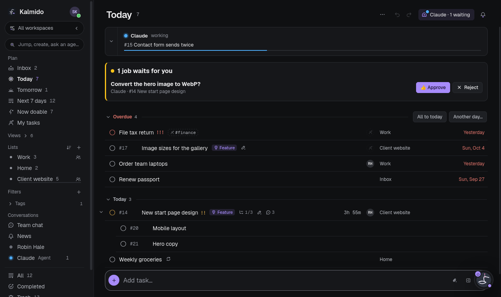</picture></p>

<p align="center"><b><a href="https://kalmido.com/demo/">Try it in your browser</a></b>: no account, no server, your data stays in your browser.</p>

> **Language:** the interface is **English** by default, with **German** included and **French, Spanish, Italian and Dutch** in beta (machine-translated, corrections welcome); switch under *Settings > General > Language*. More languages are welcome, see [CONTRIBUTING.md](CONTRIBUTING.md#translations) and [TRANSLATING.md](TRANSLATING.md). Kalmido = calm + the Japanese -do (道, “the way”, as in aikido or judo): the calm way of getting things done.
> Kalmido is an independent project and not affiliated with any other task app.

## What's new

- **2.28.0** (2026-10-08): Work and private apart. Every list and agent belongs to a **workspace** (private or an
  organisation) with a **switch in the sidebar**; a new server mode runs **several organisations on one server**, each
  with its own admins. **Personal agents are invisible to admins**, agents get a **robot badge**, News split into **For
  you** and **Activity**, agents ask with **answer buttons** in the chat.
- **2.27.0** (2026-10-08): Bugs & polish. A window running **old code after an update** says so and reloads; **shared
  folders look the same for everyone**; automatic **tidy-up waits until nobody types**; new **projects start without
  sections** unless you ask; **comments at the bottom** of a task again; agents per folder in the settings; and 20
  smaller fixes.
- **2.26.0** (2026-10-06): Agents in a team. The list owner decides **who may address its agent**, agents do not
  instruct each other, **one agent per list**, approvals **to integrate and to deploy** without a pull request; several
  tasks **edited at once** in the task panel, a **resizable sidebar**.
- **2.25.0** (2026-10-06): Usability, part 2. **One word per thing** in every language (*Plan*, *Focus timer*, *Start*,
  *Project status*, *Project page*, *Waiting on someone* vs. *Blocked by*, *Shown fields*); **a sidebar you arrange**
  (groups up / down, hide groups and entries); **settings that start with an overview** on phones, modules in folded
  groups, Integrations in plain words and a clear *does this device ring?*; **menus that only offer what works** (a long
  press opens the task's menu, the path of a task moves it, *Delete…* in every list menu); a **calm first start** for
  people who are invited; and the app says when your changes are **saved**.
- **2.24.0** (2026-10-06): Usability. A **direct message** one tap away (person card, *Tasks of …*, team chat); your
  **own lists right below Inbox and Today**; **one task menu** in a fixed order; a calmer **Today**; the **assignee and
  the comments at the top** of a task; a **settings search** that finds buttons and helper texts; **Administration in
  sub-tabs**; a profile picture **cropped with a round mask**. The unfolded **Fold held sideways** gets the desktop
  layout, **DeX** stops sliding when typing. For running Kalmido for others: **storage per person** with *Contact
  support*, a **notice to everyone** before maintenance (also from scripts), **e-mail limits** per day and a **note to
  everyone in a list when an agent joins** (and where it runs).
- **2.23.0** (2026-10-05): Team, family, clients. **Clients** above your lists with hours, budget (hours or money),
  estimate vs. actual and a **timesheet per client and month**; **workload** per person and week against their hours;
  **approvals** as a step of a task (approve, ask for changes, reject); **forms** whose link creates a task (requests,
  bug reports); **registration on the login page** (by e-mail domain, with an admin's approval or open); **sign-in links
  with a QR code** for family members without e-mail; the kind of server (one organisation or a shared server) is set in
  the configuration; agents hear about tasks that are added to their lists; a tidier sidebar.
- **2.22.0** (2026-10-05): Home & life. Seven small modules, each off until you want it: **contracts** with the last day
  to cancel and the cost per month, **devices** with their warranty and **upkeep** that comes back, **staying in touch**
  with the people who matter, **health** (appointments, check-ups, medication) in a private list agents never see, the
  **day and week in review** with a private **journal**, **trips** with bookings and packing lists, and **read later**
  (also from Karakeep). Quick add knows `@` and pasted images, *Waiting on external* is one tap away, Today can show the
  inbox, new lists get an emoji, the heron flies, and the sidebar folders read as a tree.
- **2.21.0** (2026-10-05): Events & contacts. Kalmido keeps your **events** and **contacts** itself, next to the tasks,
  and your phone's own **calendar and contacts apps sync directly** (CalDAV and CardDAV: iPhone, Android with DAVx⁵,
  Thunderbird). Events with time zones, repeats (also *only this date*), reminders, **invitations** with answers and a
  linked **preparation task**; several calendars, shared like lists; an **agenda**; drag over free time in the week to
  create one; **ICS import** (e.g. a Google export). Contacts with search, groups, photos, birthdays as tasks, linked to
  tasks (*waiting on*, *responsible*) and events; vCard import. API + MCP with the new permissions *calendar* and
  *contacts*. The family events of 2.19 became real events. Starting while the server is down shows your tasks.
- **2.19.0** (2026-10-04): Family. A module for households, off until you want it: **birthdays and anniversaries** with
  the age, gift ideas and an import from your **contacts** (CardDAV); household chores that **take turns**; **child
  accounts** with a simple view, stars and rewards; **who comes along**; **shopping lists** by shop area with a shopping
  mode; a **meal plan** whose ingredients go to the shopping list in one tap; household **deadlines** (passport, car
  inspection, insurance); **packing lists** from templates. The setup asks *What do you use Kalmido for?*. Profile
  pictures are herons, the search button stays in reach with the phone sidebar open, "+" for more reactions in the chats.
- **2.18.0** (2026-10-04): Software & Planning. **Milestones are tasks** (a diamond in the list, Kanban, calendar and
  timeline) with their tasks, progress, a burndown and release notes; **create tasks right in the timeline** (drag a
  range, double-click, "+") which now shows **sections**; **GitLab** and **Bitbucket Cloud** next to GitHub and Gitea /
  Forgejo, a release tag reaches its milestone, **error reports** (Sentry or any JSON) become tickets; the **project type**
  of a list can be changed; **code highlighting** and `file:line` links into the repository; reactions sit visibly at
  every chat message; the search icon always stays in the phone header; a new app icon.
- **2.17.0** (2026-10-04): Communication. A **team chat** (direct messages between people who work together and one
  channel per shared list, agents included), **notes** per list or project (Markdown, `#123` links tasks, search),
  **tasks by e-mail** (a secret address per person and list) and the daily summary by e-mail, **News bundled** per task
  with "Needs you" first and *Summarize* by an agent, a **dashboard** behind the logo, and fast very long lists.
- **2.16.0** (2026-10-04): Accessibility (WCAG 2.2 AA, see [docs/ACCESSIBILITY.md](docs/ACCESSIBILITY.md)): the whole app
  by keyboard with a visible focus, names and states for screen readers, messages read out, errors in words, priorities
  and overdue dates not only in colour, moving tasks without dragging, high contrast and reduced motion. Also: drag the
  task panel and the chat wider or narrower, column widths by dragging, your account at the top of the sidebar,
  density for the sidebar too (and *Custom*), a reaction button on every chat message, the command field asks an
  agent or creates a task, clearer Today / Tomorrow icons, a *Pinned* view across all lists.
- **2.15.0** (2026-10-03): Permissions for API tokens and agents (read, tasks, comments, structure, delete, files, time,
  export) with a server-wide limit and address restrictions; an agent's dangerous changes wait for a person's
  approval; the API and the MCP server now cover everything the app does (sections, moving with position, batches,
  dependencies, custom fields, templates, trash, file uploads, folders, sharing, filters, habits, timer); a new person's
  inbox is named in their language.
- **2.14.0** (2026-10-03): *Columns…* per list: pick and order the columns of the rows (task number, date, priority,
  assignee, tags, time, subtasks, dependencies, created, custom fields), the same for everyone in the list; quick add
  opens the new task's details or attaches files right away; a calm heron in empty lists, on Today and on the error pages.
- **2.13.4** (2026-10-03): Phone round: touch drags scroll at the edges and move tasks to other lists, the section "+"
  above the keyboard, the chat and comment box with the keyboard, Markdown lists keep counting.
- **2.13** (2026-10-03): Images and files in the agent chat, Markdown in comments and chat, the task next to the
  chat on desktops, many phone and Fold polish fixes.
- **2.12.0** (2026-10-02): Try Kalmido in your browser without an account (the [demo](https://kalmido.com/demo/)); quick
  add understands French, Spanish, Italian and Dutch words too.
- **2.11.0** (2026-10-02): French, Spanish, Italian and Dutch (beta), a day plan that never moves due dates, violet as
  the default accent, subagent usage in the Claude Code hook.
- **2.10.0** (2026-10-02): Groups for sharing and "whoever has time" tasks, *Plan my day* between your appointments
  (built in or by an agent), an evening review, real client addresses behind a proxy.

## Why Kalmido

- **Free for everyone in the house or team.** No per-seat subscription, unlimited users, lists and tasks, and everyone you share a list with works in it for free.
- **One app instead of three.** Tasks, habits, focus timer and real time tracking with rates and timesheets, plus the team essentials: sharing, assignment, comments, activity, a News inbox, dependencies, project status and custom fields.
- **Simple when you want it.** Switch *Collaboration* off and it is a quiet personal list again.
- **Yours.** Runs on your own server, no vendor account, no telemetry (the optional update check only asks GitHub for the latest version number), open source under the AGPL-3.0. Fits a self-hosted setup: single sign-on through your proxy, Web Push or ntfy notifications, Paperless-ngx, a calendar feed.
- **Honest trade-offs.** No native apps or widgets (it is an installable web app), no location-based reminders, and it is a hobby project, not a company with a support desk.

## Features

**Tasks**
- Lists with emoji, own picture or colour, folders with one level of subfolders, sections (Kanban columns) with a "+" each, collapse / expand all, archive
- **Folders and subfolders**: *Clients › Company X*. The sidebar is a tree (a folder's lists, then its subfolders),
  folded folders stay folded on all your devices. Drag lists into a subfolder, a subfolder into another folder or onto
  *Lists* (top level); the folder menu (…) has *New subfolder…*, *Rename*, *Move into a folder…* / *Move to the top
  level* and *Dissolve* (lists and subfolders move up one level). Opening a folder shows the tasks of all its lists,
  subfolders included, with a small header per subfolder. In the list dialog type `Clients / Company X`. A list in
  its owner's folder sits for everyone in that folder and place, and the owner's folders keep their order among each
  other in every member's sidebar (2.27.0); a shared list without a folder can be filed where each member likes. The
  sort of a shared list is set by its owner or a list admin for everyone; a member may sort it otherwise on one device
  and the list says so. The API takes and returns the path (`"folder": "Clients/Company X"`, at most two levels)
- **Quick capture** from anywhere: `q` (or Ctrl+Space, also while typing somewhere else) opens a small box, the quick
  add syntax works and it lands in the inbox whatever view is open (unless you name a list). The installed app's icon
  menu has *Quick add*. The page `/capture` holds a **bookmarklet**: drag it to the bookmarks bar, click it on any
  page and a small window opens with the page's title and address, Enter saves it to your inbox (your normal
  sign-in, no code of Kalmido runs on that page). A system-wide key for it: Windows: Start menu > right-click Kalmido >
  More > Open file location > Properties > *Shortcut key*; macOS: Shortcuts app > *Open URL* `https://your-host/capture` >
  *Add keyboard shortcut*; GNOME / KDE: a custom shortcut that opens that address
- Drag and drop everywhere, also on touch: tasks onto a section header or into an empty section, sections by their
  handle (list and kanban), lists and folders in the sidebar (long-press on a phone); long-press a task for
  *Move to section…*
- Subtasks up to three levels, drag and drop between lists and levels
- Priorities, tags, pinned tasks (the smart list *Pinned* collects them from every list, 2.16), Markdown notes, attachments (images, PDFs, documents)
- A website link per task, shown as a small domain chip (paste a URL in quick add or share a page from Android)
- Quick add with two extra buttons (2.14): *Add and open details* creates the task and opens it at once, the paper clip creates it with files attached (the file name is the title when none is typed)
- Natural-language quick add in English and German, whatever the interface language, plus French, Spanish, Italian or Dutch when the app runs in that language: `Dentist tomorrow 3pm !high #private ~Work`, `Zahnarzt morgen 15 Uhr !hoch #privat ~Arbeit`, `Dentiste demain 15h !!! #privé`
- Recurring tasks (daily, weekdays, weekly, monthly, yearly, every n days / weeks / months with weekdays, or any RRULE for experts) with end date, count and skip
- **Dates save as you pick them** (2.6.1): in the date popover every tap (day, time, start, duration, reminders,
  repeat) is saved at once and the popover stays open for more; *Done* (or a click outside, Esc) closes it and leaves
  one undo step with *Date: … · Undo*, *Undo* in its foot puts everything back. *Settings > General > Confirm changes
  with OK* brings back Cancel / OK
- **Reminders well ahead and deadlines** (2.7.0): reminders from *On time* to *1 month* before as chips, or any number
  of minutes, hours, days or weeks up to a year with *Other…* (also as the default reminder). Tick *Deadline* and the
  task counts down on its row and in the task panel (*12 days left*), highlighted from its first reminder on;
  *On Today from the first reminder* also puts it on Today from then on
- **Repeat reminder until done** (2.7.0): a task's reminder can repeat every 5, 10, 15, 30 or 60 minutes or daily
  until it is completed, starting with its first reminder (e.g. *2 weeks before the deadline, then daily*). Set it per
  task in the date popover, or as the default of a list (list dialog). The push offers *Done*, *Stop reminding* and
  *Snooze*. Nothing repeats during your quiet hours (*Settings > Notifications*, 22:00 to 07:00 by default), for a
  list whose bell is muted, or with *Repeated reminders* switched off in the notification matrix; completed, deleted
  and archived tasks stop at once, and every interval sends one push at most
- Smart lists (inbox, the start view; today, tomorrow, next 7 days, now doable, all), combinable filters (list, date, priority, tag)
- **Plan my day** (2.10.0): in Today, *Plan my day* puts your open tasks into the free time between the day's calendar
  events and timed tasks within your working hours (*Settings > General > Day planning*): overdue and due first, then
  deadlines and priority, 30 minutes for a task without a duration; what does not fit is listed as *does not fit
  today*. *Fill free time* only fills the gaps with tasks not planned yet. A timeline preview, leave out what you like,
  one undo step. Planning sets only a task's planned start and duration (2.11.0): **due dates, times and deadlines never
  change**; planned tasks show in Today with their time and can be unplanned in the task panel. With an agent online, *Let an agent plan* asks it for the same plan as a proposal that you approve
- **Daily review** (2.10.0): after your working hours Today shows what you finished, what is still open and what you
  moved, with a suggestion for the next working day; optionally as a push at a time you choose
- **Now doable** (`g d`): what you can start right now: open, not waiting on another task, due today, overdue or
  undated, and yours (assigned to you, or unassigned in your own lists; everything with collaboration off). In the
  order the dependencies allow, with a count in the sidebar; pin it as a tab like the other smart lists
- **Overdue in one click**: on top of Today, *3 overdue → Today / Tomorrow / Next week (Mon) / Pick a date…* moves
  every overdue task you may change at once (time and repeat stay, view-only ones are skipped and counted), one undo
  step; the × hides it until tomorrow on that device
- Multi-select (Shift-click a range, Ctrl/Cmd-click single tasks) and multi-edit in the task panel (2.26.0: the shared fields of all selected tasks, *Mixed* where they differ, one undo step), snooze, trash with restore, search in titles, notes and links
- **Undo and redo history**: ← / → in the top bar step back and forward through your last 30 changes (edits,
  completing, deleting, moves, sections, list settings, batch actions, moving projects); right-click or long-press ←
  to jump back several steps. Ctrl/Cmd+Z, Ctrl/Cmd+Shift+Z, Ctrl+Y; on phones *Undo* / *Redo* sit at the top of the header's “…” menu (touch tablets and an unfolded foldable keep the arrows in the header while there is room).
  Settings changes are steps too. Never overwrites what others changed meanwhile, works offline
- **Settings save themselves**: every switch, field and choice applies at once with a small *Saved · Undo*; one
  *Modules* page with a sentence per module; developer things (API tokens, webhooks, rule texts) folded under
  *Advanced*; the upload token for sharing from a phone lives in one place, *Integrations > Share from your phone*
- **Archive instead of delete** for lists (undoable); deleting for good only from the archive, with a dialog that names
  what is lost. All questions use the app's own dialog, and whatever can be undone asks nothing. Tasks of an archived
  list stay out of Today, filters, the calendar, reminders and the digest until you restore it. *Archived* in the
  sidebar opens all archived lists (tasks, folder, archived date, owner) with Open, Restore and Delete permanently
- **Folder view**: click a folder name in the sidebar for all its lists' tasks in one view, grouped by list
- **One tap "Today" / "Tomorrow"** in the task menu, the task panel and the selection bar (keys `t` / `Shift+T`);
  time, reminders and repeat stay. **Completed tasks are shown** everywhere; hide them per list, filter and smart list
  (its “…” menu) or in the calendar (its bar)
- **Own date and time pickers** in the app language: a small month grid (the week starts on your locale's first day)
  and hours / minutes you can also type (`930`, `9:30 pm`, `21 Uhr`); keyboard and touch friendly
- **Templates**: save a task with its subtasks, or a whole list with sections, and reuse it with dates relative to today
- **List types**: *List* or *Project* (time tracking, dependencies with the Gantt timeline, custom fields, progress and
  status for that list only). Every list can **show completed at the bottom** (what you tick off stays there and comes
  back with one tap: shopping and packing lists). Set it in the list dialog or the list's menu; plain lists stay free of project controls (the repository
  section shows only for projects or a list that already has one)
- **Running indicator** in the top bar: time tracking, a focus session or the stopwatch, each with its own icon, the
  time and the task; a click shows the task with Pause / Stop. The *Time tracking* page shows a running timer as a
  large card (live time, task, project, start, Stop)

**Views**
- Calendar (month, week, day) and a timeline, drag tasks onto days
- **Gantt timeline**: dependency arrows between the bars, a red mark when a task starts before the one it waits on is
  due, link two tasks by dragging from one bar onto another (long-press on a phone, keyboard too), and optionally
  *Move dependent tasks along* when a date slips, with one undo for the whole chain
- **Roadmap**: *All* as a timeline: every project on one chart, grouped by folder, collapsible to one summary bar per
  project with its progress; drag a summary bar (or long-press it on a phone) to move the whole project, one undo
- **Calendar subscriptions**: events from Google Calendar, iCloud, Outlook or any CalDAV server (Nextcloud, Radicale,
  Fastmail, ...) right next to your tasks, read-only, with "Create task from event"
- Eisenhower matrix (priority x due date)
- Kanban per list
- **Statistics**: completions per week / day and per list, on-time rate, overdue trend, focus time, habit streaks

**Habits, focus and time**
- Habits per day or *n* times per week, counters (e.g. 8 glasses of water), notes per day, streaks
- Pomodoro timer and stopwatch, focus minutes per task
- **Time tracking** (project lists): a timer on any task that follows you across devices, manual entries, hours per list and task
  for any period, rounding, hourly rates, CSV export and a printable timesheet
- **Time sum in the list header** (2.7.0): a project list (and a folder of them) shows its tracked time in hours and in
  working days, e.g. *12.5 h · 1.6 days*. The length of a day / shift is one value for the whole server
  (*Settings > Administration*, 8 h by default) that a list can override in its dialog, the same for everyone in it. A
  number field *Budget h* (the agency project type has one) adds a budget bar: tracked against the sum of the budgets

**Together**
- Several users, each with their own inbox, habits, filters, tags, settings and notifications
- **Groups** (2.10.0): an admin creates groups (*Office*, *Field team*; optionally synced from a sign-in group of the
  OIDC provider). Share a list or a whole folder with a group and a role: whoever joins gets access, whoever leaves loses
  it, and a person's role is the higher of their own and the group's. Assign a task to a group, "whoever has time": it is
  in *Assigned to me* for every member until one of them takes it. Groups appear under *Team* in the sidebar
- **Shared list tags** besides your personal tags: tags that belong to a list, with a colour per list, visible to
  everyone in it (`1.9.0`, `bug`, `Client X`). In shared lists the tag input suggests list tags first; your personal
  tags keep a small person icon, and one click turns a personal tag into a list tag. Filters, the sidebar and the API
  know both
- **Reactions** 👍 👎 ❤️ or any emoji (+) on comments, with the names on hover or tap
- Share a list with others as admin, member, participant (sees only the tasks assigned to them) or viewer; shared lists show up in their smart lists, calendar and search
- Assign tasks and subtasks in shared lists, with an assignee column (pictures, one click to assign): reminders go to the assignee, plus an *Assigned to me* list
- Comments on every task with @mentions and files, at the end of the task panel with the comment box always at the bottom edge (2.0.6: also as personal notes in private lists, own *Comments* module), an activity history (who changed what, when) and unread markers
- A *News* inbox (bell icon with an unread badge): mentions, comments on your tasks, assignments, completions, unblocked tasks, status updates and lists shared with you, newest first; filter *Mentions & assigned to me* and *Unread only*
- **Dependencies:** a task can be *blocked by* other tasks (also in other lists); it shows *blocked* until they are done, and its assignee gets a message when the last one is finished
- **Waiting on someone** (2.1.0): mark a task as waiting for someone outside (a client, an office, a delivery) with a note and a follow-up day (task menu > *Waiting on someone…*, or *Waiting on…* in the task panel, which also offers *Another task*). It shows an hourglass chip, sits in the smart view *Waiting on someone*, and on the follow-up day you get a reminder and a News item, while agents that follow the task get the event `followup_due`. One click (the × on the bar in the task panel) ends it. API: `PUT` / `DELETE /api/v1/tasks/{id}/waiting`, `GET /api/v1/tasks?waiting=true`; MCP `set_waiting`, `clear_waiting`, `list_waiting`
- **Project status and progress:** a progress bar per list, a status (*On track*, *At risk*, *Off track*, *On hold*, *Complete*) with a short note, and the **project status** (*Where is it stuck?*) with the overdue, blocked and unassigned tasks across all lists
- **Project page:** every project list has a tab next to List / Kanban / Timeline with its description (Markdown), key links, milestones (also in the timeline), project files plus the files of its tasks, members, status updates and the tracked time
- **Custom fields** per list: text, number (with unit), selection with colours, date, checkbox, person or link; shown as chips or columns, usable in filters, sorting and search
- **Shown fields per list** (2.14): list *…* > *Shown fields…* (or the button in the list header) picks which columns the
  rows show and in which order: task number, date, priority, assignee, tags, tracked time, subtasks, dependencies,
  created and the list's custom fields. The setting belongs to the list, so every member sees the same; the owner and
  list admins change it, *Default* goes back to the standard layout. Desktops show a title row above the columns; where
  the list column gets narrower (a Fold, the task panel open) and on phones the first two columns stay in the row and the
  rest moves into its second line. API v1 (`columns` on lists) and the MCP tool `set_list_columns` read and set it
- Push notifications for new comments, mentions, assignments and completions, bundled so a busy task does not spam you
- **Public links**: share one list with people who have no account through a secret link, view only or *view and tick off*, with an optional password and expiry
- One switch (*Collaboration*) turns all of this off for a simple personal task list, per person or (admins) for the whole server;
  *Dependencies* and *Custom fields* are modules of their own, so a household list stays simple while a small team
  (an agency, a club) gets the project tools
- Built-in login or single sign-on through your reverse proxy (Authelia, Authentik, oauth2-proxy)
- **Two-factor authentication** for the built-in login: authenticator app (TOTP) with recovery codes, or **passkeys**
  (also for logging in without a password); admins can require it for everyone
- **Log in with an OpenID Connect provider** (Authentik, Keycloak, Authelia, Google, ...): code flow with PKCE, only
  accounts an admin created (or automatic accounts, if you want), optional group check and admin group
- **Automatic backups** of the database and all attachments, daily with retention, optionally encrypted, downloadable,
  and a **restore** right in the app (checked, with a safety backup of the current state first)
- **Admin alerts** over each admin's own channel (Web Push or ntfy): a new version, devices that stopped taking pushes, watchdog errors, failing integrations, repeated failed logins, low disk space or a failed database check reach the admins, never with task contents

**AI agents**
- **Agents as team members**: an admin adds an agent (Claude Code, Codex, n8n, a local model, your own script) as a
  user of type *Agent*: never an admin, no Paperless, sees only the lists shared with it, with its own API token, an
  optional webhook and an on/off switch that stops everything at once
- **Settings > Agents** (called *AI colleague* before 2.6.0; 2.7.0: shown while the *Agents* module is on, and to
  admins while agents exist): one tab in four sub-tabs (2.5.1). *Status* (2.7.0, was *Overview*): a card per agent with its state, lists and
  usage; admins add, edit, test and pause them there (username, display name and profile picture: a preset, an own
  photo or the initials). *Lists*: which lists each agent sees, *Share all* / *New lists automatically*, and a table
  of the lists you manage (shared ones first, *Show all*, search): which agent sees it (one click shares or unshares),
  its tidy mode and which agent tidies it up. *Usage* and *Log* (admins) below
- Agents get **events** as signed webhooks or by **long-polling** (no public endpoint needed): @mentions, assignments,
  comments on their tasks, chat messages and reactions. A task event
  brings the task's newest comments and the list's sections along, so the agent can act at once; list pages can be
  fetched compact
- **Approvals**: 👍 / 👎 on an agent's comment from the list owner, a list admin or the assignee counts as approval or
  rejection; nothing needs to happen without it. 2.15.0: deleting lists or fields, emptying the trash, changing 10+
  tasks at once, moving lists and sharing by an agent always wait for *Approve* (then run as the agent) or *Reject*
- **Permissions** (2.15.0): each agent and each API token gets only what it needs: *Read*, *Tasks*, *Comments*,
  *Structure*, *Delete & trash*, *Read / Upload files*, *Time tracking*, *Export* (new agents: read, tasks, comments).
  Admins set them for team agents, owners for their personal agents (lock button); a server-wide limit and an optional
  address restriction per token; the MCP server shows only the allowed tools
- **Status and jobs**: a dot on the agent's avatar (idle, working, waiting for you, error), a chip in the top bar
  (*Claude · 2 running · 1 waiting*) and an *Agents* tab with its jobs, a short log and *Approve* / *Reject* / *Stop*
- **Chat** with an agent in a side panel (a tab on the phone); the agent can create tasks and comments within its rights.
  The header shows typing dots while it writes to you and what it is doing: *working on #51*, *waiting for you*,
  *ready*, *paused*, *limit reached* or *offline* (2.4.1). 2.13.1: send screenshots and files in the chat (paperclip,
  paste, drag and drop, or *Send to agent* from the phone's share sheet); thumbnails open in a lightbox, the sender can
  remove a file, and agents can read chat, task and comment files through the API / MCP (`get_attachment`)
- **Agent reads every comment** (2.13.1): per list, the checked agents hear about every comment people write there, not
  only on tasks they follow (on by default for the list's tidy agent)
- **Tidy up** per list (off, suggest, automatic) by exactly one agent of the list (*Tidy up by*, 2.4.1): it turns
  quickly typed entries into a short title, section and tags; the original text stays at the top of the notes, a
  suggestion is applied with 👍
- **Runtime settings** per agent (2.4.1): model, auto-compact threshold, a nightly fresh restart and *Reset now*.
  Kalmido only stores them; the agent's host applies them ([mcp/agent_launcher.sh](mcp/agent_launcher.sh) for Claude Code)
- **MCP server** ([mcp/](mcp/)) so agents can use Kalmido as a tool, and a protocol description in
  [docs/AGENTS.md](docs/AGENTS.md). 2.15.0: everything the app does is in the API and the MCP server (a test checks it)
- **Setup guide** ([docs/AGENT-SETUP.md](docs/AGENT-SETUP.md), in the app under *Settings > Agents > Set up*): an agent step by step, either by pasting one prompt into Claude Code or by hand (sandbox user,
  firewall, MCP wrapper, rules, event loop, autostart, test checklist)
- **Usage and limits** (2.1.1): agents report their model usage (tokens, optionally the cost; numbers only, never
  prompts); *Settings > Agents > Usage* shows today / 7 / 30 days per agent, behind *Details* a chart per day, top tasks, lists and
  models (admins: every agent; others: the agents and lists they share), the Agents view a compact card, the task panel
  *AI usage*. Per agent a soft limit (News + push to the admins at 80 % / 100 %) and a hard limit (its API calls get
  `429` until the next day / month or a higher limit). A Claude Code Stop hook ([mcp/claude_usage_hook.py](mcp/claude_usage_hook.py))
  reports a session's usage by itself, and as SubagentStop hook (2.11.0) the usage of its subagents too
- **Activity log** (2.2.1): every API request an agent makes (route, status, task / list, duration; never content) in
  *Settings > Agents > Log* for admins, filtered by agent, status and day, event polling hidden by default, denied calls marked, CSV export;
  kept `KALMIDO_AUDIT_DAYS` days (default 90)
- **Git integration** (2.2.0, 2.18.0): connect a project list to GitHub, GitLab, Gitea / Forgejo or Bitbucket Cloud; pull requests (state, CI), commits
  and branches show up at their tasks (`#123`, `kalmido-123`), `fixes #123` in a merged pull request completes the
  task. Works by polling, so the server needs no public address. **Hand a ticket to a coding agent**: it gets the
  repository and a branch name with the assignment and merges only after your 👍 on its *Ready to merge* comment
  ([Git integration](#git-integration))

**Fast and friendly**
- **Resize the panels** (2.16; the sidebar too since 2.26.0): drag the edge between the list and the task, or between the task and the chat, to
  make them wider or narrower (desktops, an unfolded Fold; each device remembers it, a double-click goes back to the
  standard width; with the keyboard: focus the grip, ← →, Enter). **Column widths** work the same way: the grip at the
  right of a column title (per device and list)
- Command palette (Ctrl/Cmd+K, the field at the top of the sidebar) for tasks, lists, views and actions, the recently
  viewed ones on top; type text and pick *Ask <agent>: …* (sends it to the agent's chat) or *Create as task: …* (quick
  add syntax; Enter when nothing else matches); `#123` jumps to task 123; keyboard shortcuts (`?` shows them all: arrows, Space to complete, E to rename in the list; calendar 1-4 / ← → / `.`; multi-select Ctrl/Cmd+A, Shift+↓ ↑, Shift+X, then Space, M or D for the selection; D / M open the date / list field of the multi-edit panel), compact, comfortable or custom density (the sidebar and the task rows each on their own); your account sits as your picture at the right of the *Kalmido* row (Account, Settings, Log out)
- New accounts start with a "Getting started" list and a short welcome tour
- A **sample project** to try things out: an image film for a client with phases, dates, dependencies, custom fields and a packing checklist, offered in the setup and the tour, removed again in one click (Settings > Data)
- When Today is clear or a list is done, the heron celebrates (with one of 50 dry one-liners). Can be switched off.

**Everywhere**
- Installable web app (PWA) for phone and desktop, works offline: changes queue up and sync later, with conflict detection
- Sorting per view: priority, manual, date, title, *Created* (newest or oldest first, with the creation day on the rows), Flow and custom fields
- On phones every choice list (list, section, assignee, settings) opens as a bottom sheet like the app's menus: icons, a check on the current value, a search field for long lists
- Mobile layout with swipe gestures, long-press drag, configurable tab bar per device (on the desktop one sidebar with grouped navigation: Focus, Views, Lists, Filters, Tags and Team); tablets in portrait keep the composer at the bottom
- Push notifications without an extra app (Web Push: Chrome, Edge, Firefox, Safari, iPhone and iPad from the Home Screen) or via [ntfy](https://ntfy.sh): reminders with *Done* / *Snooze*, focus end, habit reminders, daily digest, comments and assignments; a notification you handled on one device (task completed or opened, News read) closes on your other devices
- Share from your phone into the inbox: a ready-made import for the Android app HTTP Shortcuts, a guide for the iPhone Shortcuts app (see below); app shortcuts (long-press the icon: new task, today, news, search)
- Profile pictures: ten heron presets (2.19.0) or your own photo (cropped square, resized, metadata removed), shown wherever the initials were
- **Events and contacts** (2.21.0): your own calendars and address books in Kalmido, synced with the phone's calendar and contacts apps ([Events](#events), [Contacts](#contacts))
- **Calendar apps (CalDAV), both ways**: every list as a task list in Reminders (iPhone, iPad, Mac), Thunderbird, Evolution, Tasks.org or DAVx⁵ on Android, with an app password per device ([Calendar apps](#calendar-apps-caldav))
- **Calendar subscription**: your open tasks with a date as an ICS feed for Google Calendar, Apple Calendar, Outlook or Thunderbird
- Optional [Paperless-ngx](https://docs.paperless-ngx.com) integration: link documents to tasks, send attachments to Paperless
- **Import from Todoist, Trello, Asana, Microsoft To Do, TickTick and any ICS / VTODO file** (Apple Reminders exports, Nextcloud Tasks, Thunderbird) with a preview, re-import without duplicates and undo ([Moving from other apps](#moving-from-other-apps)); export everything as JSON (incl. your time entries)
- **REST API** with personal access tokens (`/api/v1`, OpenAPI 3.1) and signed **webhooks** for Home Assistant, n8n or your own scripts ([docs/API.md](docs/API.md))
- **Appearance per device**: dark or light theme, compact or comfortable rows, font size from 75 to 150 % in 5 % steps, also with Ctrl + / − / 0 (the whole interface scales, not just the text), Geist, your system font or the low-vision friendly [Atkinson Hyperlegible](https://www.brailleinstitute.org/freefont/), and seven accent colors (violet by default) that all meet WCAG AA in both themes
- English and German interface, French, Spanish, Italian and Dutch in beta (translations are plain JSON files, [fix or add yours](CONTRIBUTING.md#translations))

| | | |
|---|---|---|
| 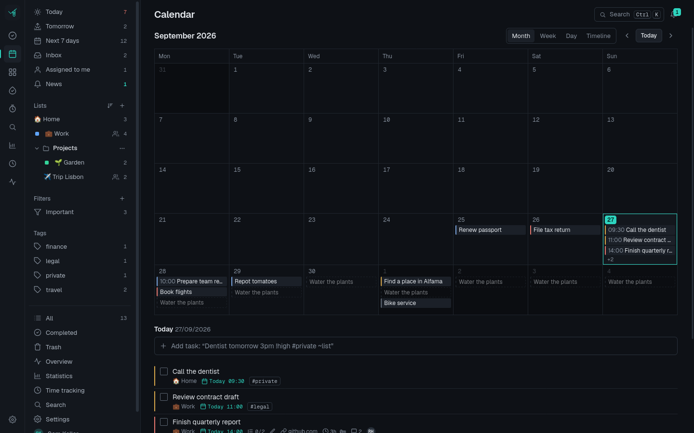 | 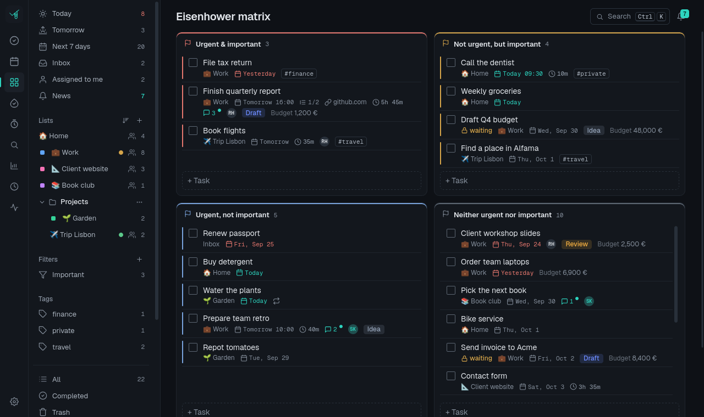 | 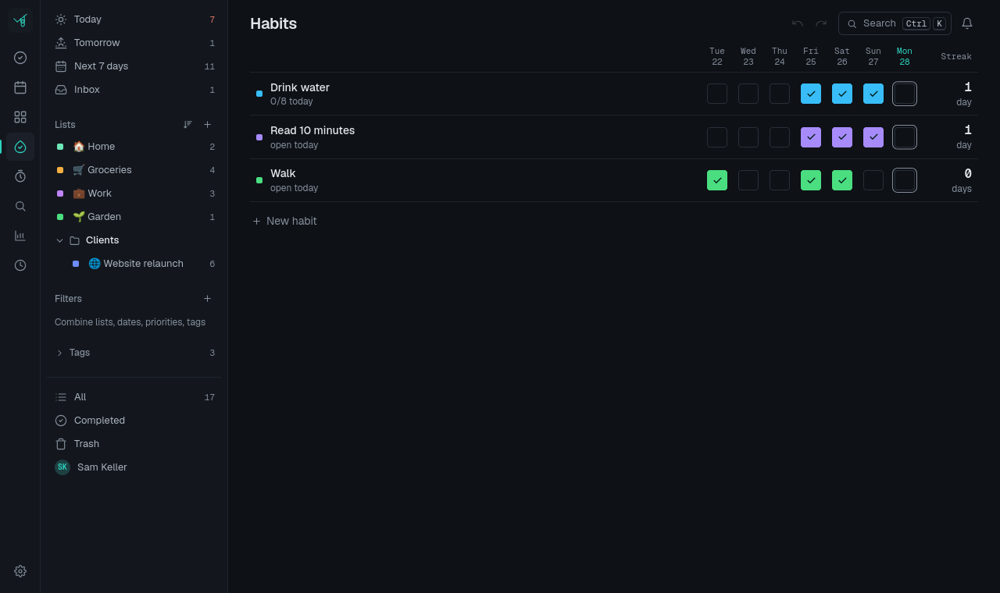 |
| Calendar | Eisenhower matrix | Habits |

| | |
|---|---|
| 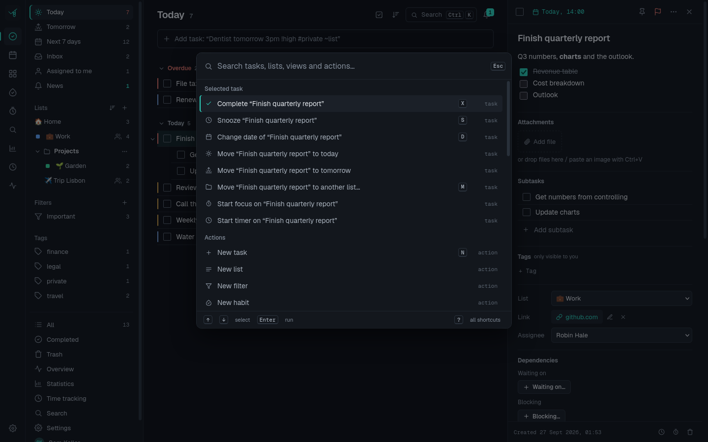 | 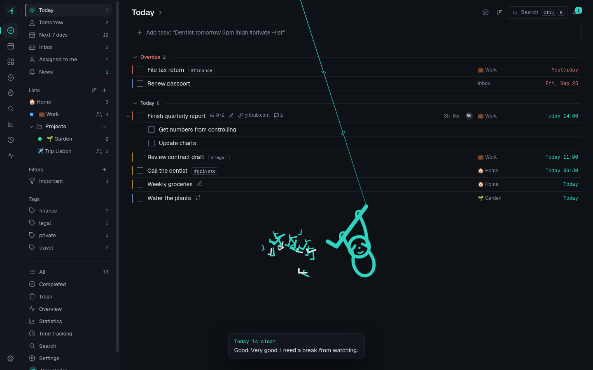 |
| Command palette | The heron celebrates |

| | |
|---|---|
| 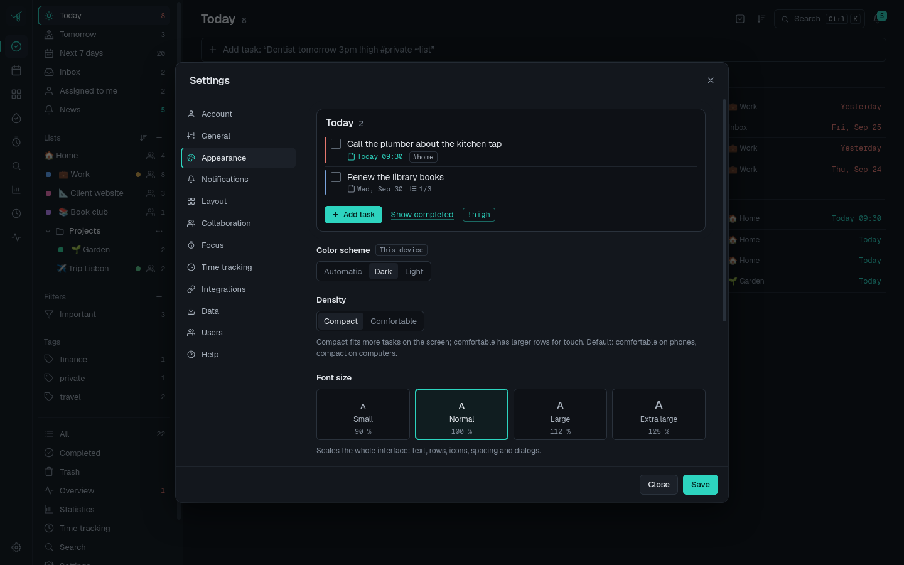 | 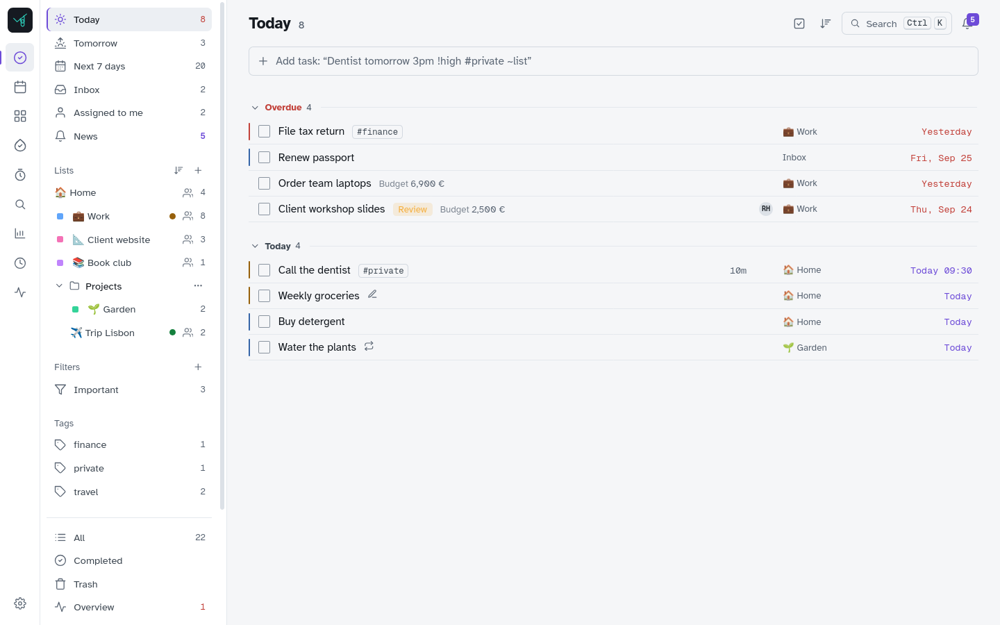 |
| Settings > Appearance | Light, violet, Atkinson Hyperlegible, 112 % |

<p align="center">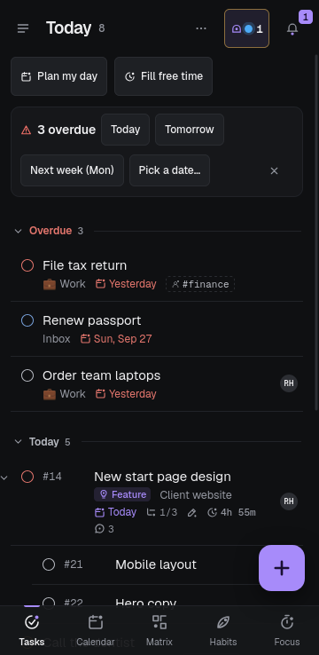 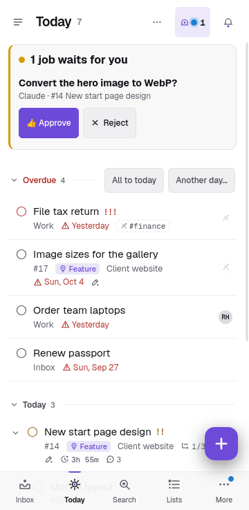</p>

## Accessibility

Kalmido aims at **WCAG 2.2 level AA**: everything works with the keyboard (one Tab stop per list, ↑ ↓ to move, Enter to
open, Esc to go back, `?` for all keys), the focus is always visible and never hidden, screen readers get names, roles,
states and announcements, errors are said in words, colour is never the only signal, every drag has another way
(menu items, Alt+↑ / Alt+↓, keys on the grips), touch targets are 44 px, *reduce motion* and Windows high contrast are
respected, and the app reflows at 320 px and 200 % zoom. An automated test with axe-core checks the main views in light
and dark and with every accent colour on every change. Details and known limits: [docs/ACCESSIBILITY.md](docs/ACCESSIBILITY.md).

## Try it without installing

[kalmido.com/demo](https://kalmido.com/demo/) runs the real app in your browser with sample data in your language (a
client website project with sections, tickets, milestones, time entries and dependencies, a personal list, and a
simulated agent that waits for your approval). There is no server behind it: an in-browser stand-in for the API keeps
everything in your browser's storage, the page's Content-Security-Policy forbids every network connection
(`connect-src 'none'`), and there is no analytics. *Reset demo* brings the sample back. Features that need a server
(push notifications, CalDAV, calendar subscriptions, real agents, Paperless, Git, webhooks, OIDC, more users) show a
short notice with the way to install.

The demo is built from the current sources by `python3 tools/build_demo.py [out_dir]` (static files only; serve the
folder with any web server, e.g. `python3 -m http.server` in it). CI builds it and opens it in jsdom
(`tests/demo_test.js`) so it cannot drift from the app.

## Quick start

Requirements: Docker with Compose.

**Installer** (macOS, Linux; Windows: `irm https://kalmido.com/install.ps1 | iex`): downloads the latest release,
uses the prebuilt image (or builds it locally if that is not possible) and starts it on `http://localhost:3040`.
It never uses sudo and writes an `update.sh` into the install folder (`~/kalmido`).

```sh
curl -fsSL https://kalmido.com/install.sh | sh
```

**By hand:**

```sh
git clone --branch v2.5.0 https://github.com/Gegenschuss/kalmido.git   # or the latest tag, see Releases
cd kalmido
cp .env.example .env        # set TZ and PUBLIC_URL at least
docker compose up -d --build
```

Instead of building, you can use the prebuilt image (linux/amd64 and linux/arm64): put
`KALMIDO_IMAGE=ghcr.io/gegenschuss/kalmido:2.5.0` into `.env`, then `docker compose pull && docker compose up -d`.

Kalmido now listens on `http://127.0.0.1:3040`. Data (SQLite database and attachments) lives in `./data`.
Open it: the first start shows a **setup page** that creates the first account (the admin). Do this right
after installing, whoever gets there first becomes admin. A second step asks **what you want to use**, with three
starting points:

| Preset | For | On |
|---|---|---|
| **Simple list** (preselected) | a plain to-do list, a household | lists, subtasks, reminders, the calendar |
| **Just me** | one person who likes views | also timeline, kanban, matrix, habits, focus, statistics, project progress, comments |
| **Projects & team** | small teams up to about ten people, e.g. an agency | everything: sharing, assigning, comments, time tracking, the Gantt timeline with dependencies, custom fields |

Under *Customize…* below the cards you can switch single modules on or off (the matching card stays highlighted),
and pick the language; *Start* stays in view. The modules become the default for new users; collaboration and time tracking are switches for the whole
server. The welcome tour and the *Getting started* list only mention modules that are on. All of it can be changed
later in *Settings*.

Below that, one question: **Start with**: *Empty*, the *Sample project*, or a project of the type *Agency*,
*Software / AI dev* or *Personal* (sections, fields and settings for that kind of work; picking one switches the
modules it needs on). More projects any time: *Lists > + > New project*.

**Sample project.** *Sample project* under *Start with* and on the first card of every new account's welcome tour
(ticked when the project modules are on) adds a realistic example in the user's
language: *Example: Image film for client Muster* with the phases Concept, Pre-production, Shoot, Edit and Approval,
about fifteen tasks around today (overdue, today, next week, undated) with start dates for the timeline, dependencies
for *Flow* and *Now doable*, all four matrix quadrants, subtasks, a Markdown checklist, tags, a weekly status call, a
comment, custom fields, a time entry and a project status, plus the list *Example: Shoot day packing list* (completed
items at the bottom). It only
uses the modules that are on, stays private and quiet (no reminders, pushes, News or webhooks, not in the daily
digest). *Settings > Data > Sample project* creates it again or removes exactly what it created: sample tasks go even
if you edited them, tasks you added yourself stay, and so does their list.

<p align="center">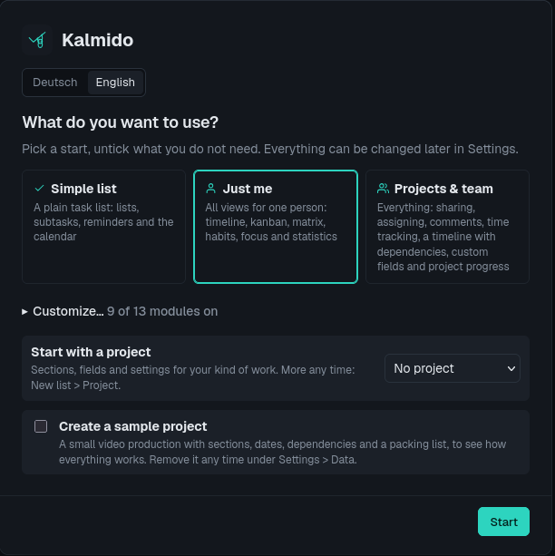</p>

> [!IMPORTANT]
> Use HTTPS (a reverse proxy) for anything beyond your own machine: the login sends your password and
> the session cookie is only marked `Secure` behind HTTPS.

## Try it locally

No proxy needed for a quick look. After the quick start above, open **http://localhost:3040** on the same machine.
Everything works there, including installing it as an app and offline mode (browsers treat `localhost` as secure).
Push notifications, Paperless and `/drop` stay off until you configure them.

To try it from your phone or another device on your network, change the port line in `docker-compose.yml` to
`"3040:3040"`, run `docker compose up -d` again and open `http://<your-computer's-ip>:3040`. Over plain HTTP the
app works, but it cannot be installed and has no offline mode.

> [!WARNING]
> Over plain HTTP your password travels unencrypted through your network. Fine for a test at home; for daily
> use put it behind a reverse proxy with HTTPS (next section) and switch the port back.

To remove the test again: `docker compose down` and delete the folder (your test data is in `./data`).

## Moving from other apps

*Settings > Data > Import*: pick the app, choose its export file, and Kalmido shows a **preview** first: how many
tasks go into which list, a few sample rows and everything that cannot be mapped exactly (a date text it did not
understand, a repetition Kalmido cannot do, a reminder without a date, ...). You choose where it goes: new lists (an
own list with the same name is reused) or one existing list you can edit. The import itself runs in one transaction.

- **Again is safe:** every imported task remembers its id in the other app (or, for formats without ids, a key made
  from list, section, parent and title), so importing the same file again only adds what is new.
- **Undo:** the report after an import, and *Recent imports* below it, offer *Undo* for 24 hours: it removes the
  tasks, sections and (empty) lists that import created. Tasks someone added below an imported task stay.
- **Safe with strange files:** at most 20 MB and 20,000 tasks per import (`KALMIDO_IMPORT_MAX_MB`,
  `KALMIDO_IMPORT_MAX_TASKS`), ZIP and JSON bombs are refused, text encodings UTF-8 (with or without BOM), UTF-16 and
  Windows-1252 are recognized, formula cells stay plain text, nothing inside a file is ever fetched from the internet
  (attachments stay links in the notes), and every task is validated like one typed into the app. Each imported task
  gets a history line *imported from ...*; imports do not send one webhook per task.
- The same import is available to scripts: `POST /api/v1/import/{source}` ([docs/API.md](docs/API.md#import)).

| From | Export there | What comes along |
|---|---|---|
| **Todoist** | Project > … > *Export as a CSV file* (one file per project), or *Settings > Backups* (a ZIP with every project). A JSON from the Sync API works too. | Sections, subtasks (indent, at most 3 levels), `@labels` as tags, priorities (the CSV scale is detected, or choose it), dates including English and German date texts (*every monday at 9am*, *jeden Montag*, *15. Okt*, *morgen um 10 Uhr*) and recurring dates, durations, deadlines, comments and attachment links (into the notes). Texts it cannot read (other languages, *every 3rd friday*) stay in the notes. |
| **Trello** | Board > Menu > *Print, export and share* > *Export as JSON* | Lists as sections of one list, or one list each in a folder named after the board; cards with description, due date and time, start, reminder, *complete*; labels as tags; checklists as subtasks (several checklists: one subtask each); members assigned when they can see the list, otherwise named in the notes; comments and attachment links in the notes. Archived cards and lists are skipped, or imported as completed. Custom fields are not imported. |
| **Asana** | Project > arrow next to the name > *Export / Print* > *CSV* | Sections, subtasks (*Parent task*), tags, start and due dates, completion, priority; other columns (custom fields, dependencies) in the notes. An assignee is assigned when the e-mail or name matches someone who can see the target list, otherwise the name goes into the notes. |
| **Microsoft To Do** | No export of its own. Classic Outlook for Windows: *File > Open & Export > Import/Export > Export to a file > Comma Separated Values > Tasks* (Outlook for Mac: *File > Export > Tasks*). CSV files of export tools and ICS files work too. | Title, list, due and start date, status, importance / priority, categories as tags, notes, reminders, steps (when the export has them). English and German Outlook columns, also in Windows-1252. |
| **ICS / VTODO** | Nextcloud Tasks (calendar > … > *Export*), Thunderbird (right-click the calendar > *Export*), Apple Reminders via an export app or a CalDAV server, Tasks.org via its CalDAV account | One list per calendar; subtasks (`RELATED-TO`), due and start with time zones, repetitions (daily, weekly, monthly, yearly), reminders (`VALARM`), categories as tags, priorities, completed and cancelled tasks. Events are skipped. |
| **TickTick** | *Settings > Account > Generate backup* | Imported directly (no preview): folders, lists, sections, subtasks, dates, reminders, repetitions, tags. |

## Users and sharing

<p align="center">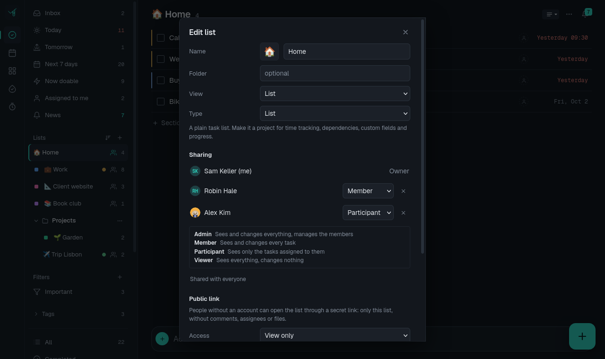</p>

- **Accounts:** admins manage users under *Settings > Administration* (username, display name, optional password,
  optional SSO login, admin flag, Paperless access, ntfy topic, disable / delete). Everyone can change their own display name and
  password under *Settings > Account*, and a profile picture there (a heron preset, an own photo or just the initials;
  admins can set a preset for someone else, e.g. the bot user of an API integration). The *Users* block comes first
  under *Settings > Administration*; agents are listed there too (with the *Agent* badge) and open their own dialog
  (*Managed under Agents*). A user who still owns lists cannot be deleted (delete the lists or
  disable the user instead); deleting removes their inbox, habits, filters and focus history.
- **Private per user:** inbox, habits, focus sessions, filters, folders and sidebar order, tags (two people can tag
  the same shared task differently; right-click or long-press a tag in the sidebar, or "…" in the tag view, >
  *Delete tag…* removes it from all your tasks after showing how many, the tasks stay, undo brings it back), settings (language, notifications, digest, ...), ntfy topic, upload token.
- **The Share dialog** (2.6.0): *Share…* in a list's "…" menu, the *Share* button next to the list title (desktop), or
  *Sharing > Share…* in the list dialog. One place for everything about who sees a list: **People** (members with their
  role, *Share with …* + role + *Add* to invite, remove), **Agents** (the list's agent: one select *Agent: No agent / …*
  -- **one agent per list** (2.26.0), switching swaps it in one step with Undo; *Members may see and use the agent*
  (default off: only the owner and list admins can chat with it, @mention it or assign it tasks here), *Agents may
  address each other* (default off), which agent may tidy up entries), the **Public link** (owner) and the **Owner** (*Transfer
  ownership…* / *Take over…* with the history). Members see who is in the list, read-only. The list dialog keeps the
  list's own settings and shows a one-line summary ("Shared with 2 people · 1 agent").
- **Sharing and roles:** in the Share dialog add people with a role (*What the roles may do* explains each one):

  | Role | Sees | Changes |
  |---|---|---|
  | **Owner** | everything | everything; the only one who renames, changes the type, archives, deletes, creates a public link or custom fields |
  | **Admin** | everything | every task, sections, project status; adds and removes members and sets their roles (never the owner's); moderates comments |
  | **Member** | everything | every task, sections, project status |
  | **Participant** | only the tasks assigned to them, with their subtasks, comments, files and time; the main task of an assigned subtask as read-only context (title, dates, status) | their own tasks; may add tasks (always assigned to themselves) and subtasks; never deletes, moves out or reassigns |
  | **Viewer** | everything | nothing (may comment) |

  A participant's view is filtered on the server everywhere (search, calendar feed, statistics, time reports, News,
  pushes, reminders, the REST API, webhooks), not only hidden in the app; sections show only when they hold one of
  their tasks. Changing a role takes effect at once. Lists shared before 1.10.0 keep their meaning: *Can edit* is now
  *Member*, *View only* is *Viewer*. Members can leave a list; the inbox cannot be shared.
- **Transfer ownership:** the owner hands a list to another person in the Share dialog (*Owner > Transfer ownership…*)
  (a member or anyone they could share with; confirmed twice). The new owner gets it in the same folder and place
  where they had it as a member (otherwise at the end of their sidebar) and a News item; the old owner stays in the
  list as a **list admin**, where it was in their sidebar. Every transfer is noted under *Owner* in the Share dialog ("Ownership
  transferred from X to Y"). Agents never become owners and never transfer; inboxes cannot be transferred.
  **Admins take over** lists whose owner is an agent or a disabled user, which nobody could manage otherwise (agents
  cannot share, disabled users cannot log in): *Settings > Administration > Lists owned by agents or disabled users >
  Take over* (for themselves or another person), or *Take over…* in the Share dialog when they are in the list. An
  agent that owned the list stays in it as a *Member* (agents are never list admins). API:
  `POST /api/v1/lists/{id}/owner` with `{"user_id": …}` (scope structure; agent tokens get 403).
  Moving a task into a list needs edit rights there, moving it out needs edit rights on its current list. Members
  with edit rights can only move a task out of a shared list into a list that all its current people can see (e.g. between
  two lists shared with the same people); moving it anywhere else is up to the list owner, so a member can never take a
  shared task (with its subtasks and comments) away from the owner. Subtasks follow their parent; a subtask that lives
  in someone else's list stays there (at the top level) when a member moves the parent elsewhere.
- **Trash:** everyone with edit rights can move tasks to the trash and restore them. Only the list owner deletes
  tasks of a shared list permanently (*Empty trash* of a member leaves shared lists of other owners alone, marks those
  items *stays* and says how many stayed). Instance admins also empty the trash of shared lists where they may edit.
- **Assignment:** in shared lists a task or subtask can be assigned to the owner or any member (task panel >
  *Assignee*, or the **assignee column**: every row of a shared list shows the assignee's picture or a dashed circle
  for nobody; a click opens the assign menu; on phones a small cell at the end of the row; 2.14: list *…* > *Columns…*
  shows or hides it, and orders it among the other columns, for everyone in the list). A subtask's assignee is independent of its main task.
  Reminders go to the assignee, otherwise to whoever created the task (if they still see it, else to the list owner). The daily digest contains your own
  lists' tasks plus everything assigned to you.
- **Export** (*Settings > Data > Export*) contains your data and the lists you own (tasks with links, comments and history) and your templates.
  Note: the export of a list owner includes the comments that other members wrote in the owner's shared lists.
- **Paperless connections** (2.1.0). The connection from the environment (`PAPERLESS_TOKEN`, named *Paperless*) works
  as before: it is the whole archive of that token's account, so an admin grants it per user (*Paperless access*;
  admins have it by default). Besides it:
  - **Server connections** (*Settings > Users > Paperless connections*, admins): a name (e.g. *Office*) and the address
    of a Paperless server, **no shared token**. The admin picks who may use it; each of them enters their **own** API
    token under *Settings > Integrations*, so Paperless' own permissions and groups decide what each person sees. A new
    address removes the stored tokens; taking a person off removes theirs.
  - **Personal connections** (*Settings > Integrations > Add my own connection*): name, address and your token. Only you
    see and use it; admins can neither see nor grant it, and no API answers with it for anyone else. Its address must
    be public, or a host an admin allowed for internal requests (the calendar allow-list, `KALMIDO_CALENDAR_ALLOW_HOSTS`).
  - Tokens are write-only: the app only shows "•••• set", never the token. They are stored encrypted (AES-GCM) with
    `KALMIDO_SECRET_KEY`, which lives only in the environment, never in the database or a backup. Without it no token
    can be stored (the environment connection keeps working); **losing the key means everyone enters their tokens
    again**. Kalmido never follows a redirect of a Paperless server, so a token only ever goes to its own address.
  - With more than one connection the link dialog and *Send to Paperless* ask which one. A link remembers its
    connection; people who cannot use that connection only see "Paperless document".

### Public links

A list owner can share one list with people who have **no account**: *Share… > Public link > Create public link* (the Share dialog, 2.6.0).
The link (`/s/<token>`, 192 random bits) opens a plain page with only that list: its sections, open tasks with their
subtasks and due dates, and the tasks completed in the last 7 days (in a checklist: all done items). Never comments,
assignees, tags, files, custom fields or anything from other lists; task notes only if you tick *Show task notes*
(then as plain text).

- **Access:** *View only* or *View and tick off*. Ticking goes through the normal completion: the history says
  *Someone via the public link*, and the task's creator gets a News item and a push like after any completion in a
  shared list (if collaboration is on). Put back on the list works too; nothing else can be changed.
- **Password** (optional, stored hashed): visitors enter it once per browser (a cookie for that link only). Changing
  or removing the password, *New link* and *Turn off* take effect at once.
- **Expiry** (optional): the link works through the end of that day.
- Only the owner creates and manages the link; the inbox cannot be shared. The page loads no scripts and nothing
  external, is marked `noindex`, is never cached, and has a strict Content-Security-Policy. Views, ticks, unknown links
  and wrong passwords are rate-limited per address; an unusual number of views of one link sends the admins an alert.
- Admins can turn public links off for everyone (*Settings > Administration > Whole server*; existing links then stop working
  but are kept); `KALMIDO_PUBLIC_LINKS=0` turns them off for good.

### Show completed at the bottom

For lists you work through again and again (groceries, packing, a cleaning routine): *Show completed at the bottom* in
the list's *…* menu, its *Sort* menu or the list dialog (2.7.2; before, this was the list type *Shopping & packing list*
/ *Checklist*: such lists became plain lists with the option on, nothing changed for their items).
Ticked-off items move to a **Done** section at the bottom (open, collapsible) instead of disappearing, sorted by name,
and go back on the list with one tap (↺). *Uncheck all* puts everything back, *Clear done* moves the done items to the
trash. Quick add works as usual, and it works with sharing and public links (*View and tick off* makes a shared shopping
list for the whole household, no accounts needed). API: the list field `done_at_bottom`; `kind: "checklist"` and the
boolean `checklist` are still accepted as deprecated aliases.

### Comments and activity

<p align="center">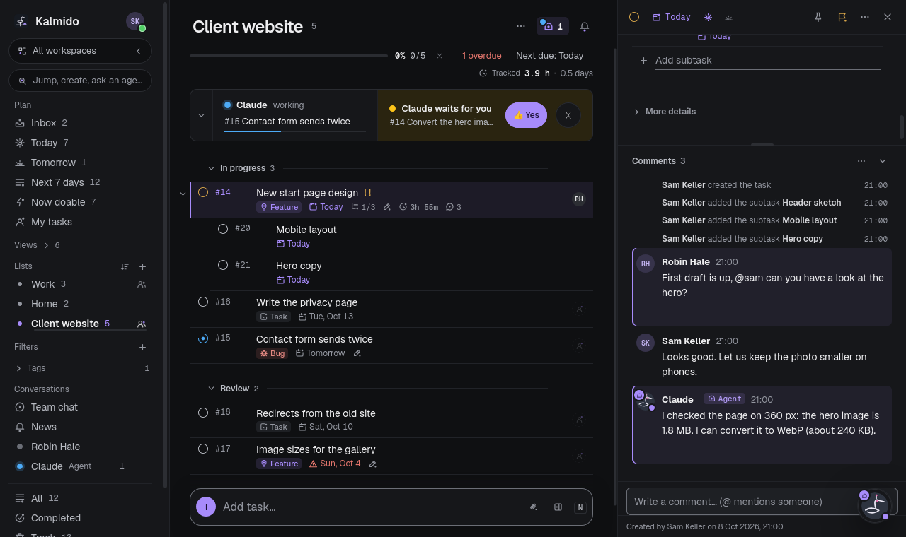</p>

- **Comments** (module *Comments*, on by default): everyone who can see a task can comment on it, including *View only*
  members (they still cannot change the task). In private lists and without collaboration, comments are personal
  notes with a timestamp: no @mentions, no News, no pushes, no history of your own changes. Checklists have none.
  The comments and the history sit at the end of the task panel (all of them, oldest first); the comment box stays at
  the bottom edge of the panel while you scroll, a single line until you use it. Opened from a comment (News, a
  push), the panel shows the newest one. Comments support a little Markdown,
  links, files (images show as thumbnails inside the comment, not in the task's attachment list) and
  **@mentions**: type `@` for a list of the people who can see the task. Mentions are stored by user, so a
  renamed user stays linked. *Ctrl+Enter* sends.
- **Edit and delete:** you can edit and delete your own comments (edited ones show *edited*, deleted ones and
  their files disappear). The owner and the admins of a list may delete any comment in it (moderation); server
  admins have no extra rights on other people's comments. Participants comment on their own tasks only.
- **Activity:** the task panel shows the history between the comments: created, renamed, dates, priority,
  assignment, moves, completion, repetition, links, attachments, subtasks, trash. Sort order, pins, reminders
  and your private tags are not logged. *Show activity* hides it (remembered per device).
- **Unread:** tasks with comments show a count; a dot marks comments by others you have not seen yet. Opening the
  task marks them as read.
- **Notifications** (over each person's own channel, Web Push and / or ntfy, in their language; tapping opens the task; never for your
  own actions and only to people who can still see the task):
  - new comment: to the assignee, the creator and everyone who commented before; *@mentioned* people always,
    with "mentioned you"
  - *Sam assigned you: task* to the new assignee (with list and due date), *Sam unassigned you from: task*
    to the previous one
  - *Robin completed: task* to the creator and whoever assigned it, for tasks in shared lists
  - bundling: after a push about a task, anything else on that task within a minute is collected into one
    summary push ("2 more comments · 1 more change").
- **Offline:** comments need a connection. Offline, the text stays in the box with a notice (task edits still
  queue up and sync later as before).
- **Comments off:** *Settings > Modules > Comments* hides every comment (they stay stored), the API refuses new ones
  (409) and you get no comment News or pushes. Collaboration keeps working without them (sharing, assigning, history,
  News about assignments and status).
- **Simple mode:** *Settings > Modules > Collaboration* (per user) hides activity, mentions, assignee chips, the sharing section, the assignee field, *Assigned to me* and the News inbox, and stops these
  notifications and News entries. Shared lists you are in stay visible as normal lists, nothing is deleted.
  The website link field is always available.
- **For the whole server:** admins can switch collaboration off for everyone (*Settings > Modules*, the
  *for everyone* switch next to *Collaboration*). Then nobody can share, assign, mention or get News and collaboration pushes
  (comments stay as personal notes), the related API endpoints answer 403, and shared lists are only visible to their owner. Personal switches are shown
  disabled. Nothing is deleted: switched back on, memberships, comments, assignments and status history are all
  there again. When an admin creates the second user while it is off, Kalmido offers to turn it on.

### News and notifications

2.28.0 (#987): News come in two parts. **For you** holds what *people* send you -- @mentions, assignments, replies to
your comments, approval decisions -- and the unread direct messages of the team chat; **Activity** holds every change
and everything agents do. The bell counts only *For you*, its dropdown shows *For you* first, the News view has the
tabs *For you | Activity | All*, and the start page shows *N messages for you* while something is unread. Pushes for
what agents do (their comments, completions, new tasks, status) are off by default (*Settings > Notifications > Pushes
for what agents do*); an agent's @mention of you and its approval requests push as before.

<p align="center">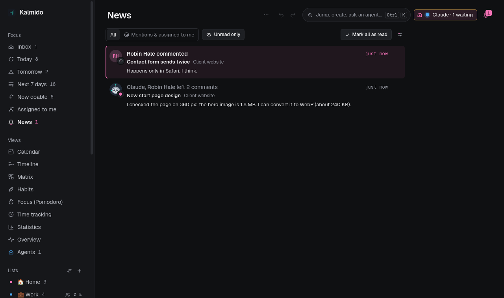</p>

**Bundled (2.17.0):** News are grouped per task (or list) with one line of what happened ("2 comments · completed"),
*Needs you* (approvals, proposals, mentions, assignments, follow-ups) above *For your information*, *Mark read* per group;
*Bundled* in the bar switches to the plain list (per device). *Summarize* sends your unread News to an agent's chat,
which answers with a short summary.

- **News** (bell icon in the top bar, also as a sidebar entry and a pinnable tab) lists what concerns you,
  newest first: *@mentions*, new comments on tasks you take part in (creator, assignee, earlier commenter),
  *assigned you* / *unassigned you*, completions by others (same rule as the push; off by default, see below), and lists someone shared
  with you, your role changes and *removed you from a list*. Never your own actions.
- Same recipients as the push notifications, but nothing is bundled: every event is kept (people without an
  ntfy topic get them too). Consecutive comments on the same task are shown as one row with a count.
- Only items you may still see: if you lose access to a list or a task goes to the trash, its items disappear;
  deleted comments disappear as well. Comment items show a short excerpt with mentions highlighted.
- Works like a mail inbox: unread items are bold, tapping one opens the task and marks it read (opening a task any
  other way also marks its items read), *×* (desktop) or a swipe sideways (touch) removes a single item, *Mark all as
  read* and the filter *All | Mentions & assigned to me* are at the top. The unread badge updates with the normal sync.
- **What notifies you** (2.1.0) is one table under *Settings > Notifications* (or the gear next to the filter): every
  event with a *News* and a *Push* checkbox. Events: comments on your tasks (created by you or assigned to you),
  replies to your comment (the comment right before is yours), comments on tasks you follow (you commented on them),
  mentions, assignments, new tasks in shared lists (someone else created them), completions by others, project status,
  lists shared with you, unblocked tasks, an agent waiting for your approval, the follow-up day of a task *waiting on
  external*, reminders (push only), repeated reminders (2.7.0, push only; a muted list bell stops them) and, for admins, an agent reaching a usage limit (2.1.1). A comment counts once, as the first of: mention, your task, reply, follow.
  Defaults = the behaviour before 2.1.0 (completions only as a push; status and sharing only in News); new tasks in
  shared lists are off, replies and follow-ups on. `GET /api/v1/me` shows the settings, `PATCH /api/v1/me/notifications`
  changes them.
- **The bell of a list** (list menu > *Notifications*, or the list dialog), for you only: *All activity* = every
  comment, new task and change in that list as News and push; *Default* = the table above; *Mute* = nothing from that
  list except mentions of you and tasks assigned to you (those follow the table); *Custom selection…* (2.6.1) = your
  own choice per event for this list, News and Push each: new tasks, comments, mentions, assignments, completions,
  project status, unblocked tasks, agents waiting for approval. A ticked event reaches you from every task of the
  list, an unticked one never; the choice is kept when you switch to another mode and back. Reminders and follow-ups
  are your own and are never muted. A muted list shows a crossed-out bell in the sidebar.
- **The bell in the top bar** (2.6.1) opens the newest News right where you are (a dropdown on the desktop, a sheet
  from the bottom on a phone): open an item, remove it, *Mark all as read*, *Show all* for the full view; a click
  outside or Esc closes it and you stay in your list. **Filter chips** (*Mentions*, *Comments*, *Assignments*, *New
  tasks*, *Completed*, *Status*, *Agents*, …, only the kinds that are there) narrow the dropdown and the News view;
  they only change what you see, per device.
- Items are kept for 90 days, at most 500 per person (`TASKS_NEWS_DAYS`, `TASKS_NEWS_MAX`).

## Start page

A tap on the logo (*Kalmido* at the top of the sidebar) opens the **start page** (the dashboard): what waits for you (approvals,
mentions, assignments), today's tasks (complete them right there), News bundled, the team chat, your projects with
their progress, pinned tasks, recent notes, the agents, a few numbers and a search field. *Customize* orders the cards
(↑ ↓, also with the keyboard) and hides the ones you do not need; the choice follows you to every device. It can also be
a tab (Settings > Appearance > Tab bar).

## Family

*Settings > Modules > At home > Family* (or *What do you use Kalmido for? > Family* in the setup, the welcome tour or
*Settings > Modules*) switches on everything for a household; while it is off, none of it shows. The **Family** view
(sidebar, tab bar, command field) brings it together.

- **Birthdays and anniversaries**: *Birthday* in the Family view (or a *Birthdays* list): a yearly task with the age
  ("turns 80"), reminded 7 days before (or 1, 3, 14, 30, on the day only) and on the day; gift ideas are its checklist
  and what was given stays ticked when the year rolls on. *From contacts…* reads an **address book** (CardDAV:
  Nextcloud, iCloud, Radicale, mailbox.org …) once a day: `BDAY`, `ANNIVERSARY` and Apple's anniversary dates become
  yearly tasks and follow changes; nothing is written back, the address and the password are stored encrypted (like a
  calendar subscription's), each date keeps the contact's UID so a change updates it instead of adding a second one, and
  a birthday you deleted is not created again. Internal servers need the admin's allow-list (*Settings > Administration > Advanced*).
- **Household chores that take turns**: in a repeating task of a shared list, *Take turns* in the task panel: pick who
  (people of the list, children too) and whether the next person comes after each completion or every week. The next
  person gets a push; Undo puts the turn back; *Whose turn* in the Family view.
- **Children**: an admin makes an account a **child account** (*Settings > Users > Edit*) and picks its parents. A child
  sees a simple view with big buttons: its own tasks only (in shared lists a child always takes part as a participant:
  only what is assigned to it, or where it comes along), its stars and the rewards. Each task it completes gives 1 star
  (or what the task says under *Stars for a child*); parents give stars by hand, set rewards (once or again and again),
  get a push when the child asks for one and approve or decline it in the Family view. A child account can tick its
  tasks, ask for rewards and change its own account; everything else stays read-only for it.
- **Who comes along**: *Who comes along* in the task panel of a shared list's task: those people see the task (children
  too) and get its reminders.
- **Shopping lists**: *Used for: Shopping list* in the list dialog (or *Add shop areas* on a list): the sections become
  shop areas (fruit & vegetables, bakery, dairy …, rename or add your own); move an item to its area once and the next
  one goes there by itself ("2 l milk" and "milk" are the same item); common items (bananas, bread, milk …) find a
  likely area the first time. *Shopping mode*: the whole screen, big ticks,
  grouped by area, add items, live for everyone shopping at the same time; ticked items wait at the bottom for next time.
- **Meal plan**: the next seven days of meals in the Family view (*+* per day); write the ingredients as a list in a meal's notes and
  the cart button puts them on the shopping list, without doubling what is already on it.
- **Household deadlines**: *Household deadline* in the Family view: passport, ID card, car inspection (every two years), insurance
  and contracts (due on the last day to cancel, every year) or anything else, with a lead time that fits; link the
  Paperless document in the task.
- **Packing lists** from templates: holiday, swimming pool, daycare, camping, business trip.
- API v1 and MCP: `/family`, `/family/occasions`, `/family/deadlines`, `/tasks/{id}/to-shopping`, `/lists/{id}/shop-areas`,
  `/family/packing`, `/family/kids`, rewards; tasks carry `family`, `rotation`, `people` and `stars` (docs/API.md).

## Workspaces: work and private apart (2.28.0)

Every list belongs to a **workspace**: your private space or one of your organisations (the list dialog, *Workspace*).
The switch at the top of the sidebar (*Private | <organisation> | All*) shows the lists, tasks, News, agents and team
chats of one workspace at a time (the inbox is always there); a chip in the header says which one you look at, and the
choice follows you to every device. A new list starts in the shown workspace.

What the server keeps apart:

- An **organisation's list** is shared only with the organisation's members (a share with somebody else is refused with
  a clear message, a share by e-mail address into it does nothing and reveals nothing); its groups must consist of
  members and its ownership stays inside the organisation.
- **Private lists** are shared with anyone you may see (also colleagues) and stay invisible to the organisation.
- **Agents work in one workspace** and join only its lists: an organisation's agent never sees a private list, a private
  agent never an organisation's list. "Used for" (family / household) and Home & life lists are private only.
- Changing a list's workspace is the owner's call and refused while people or agents in it do not fit the new one.
- *Settings > Account > Workspaces* lists your organisations with their members; an organisation's admins manage them
  there (see below).

**Leaving an organisation** (removed by an admin, or on your own): your lists of that workspace stay with the
organisation (they go to the admin who removes you, or to the next admin), you leave every list of the organisation;
your private lists go with you. When the only admin leaves, the operator (an instance admin) takes the organisation over.

**On the update** to 2.28.0 every list of a server with an organisation stays in the organisation (a server from before
was one company), except family / household and Home & life lists, lists in a top folder named like *Private* /
*Family* / *Home* and every inbox: those become private. Team agents work in the organisation, a personal agent in the
workspace most of its lists are in; an agent that already sits in a list of another workspace is kept and pointed out --
the owner decides.

## Organisations and invitations

2.23.0: the kind of server is set when it is set up, not in the app (`KALMIDO_INSTANCE_MODE`):

- **`organisation`** (the default): one company or family. Everyone is a member and sees the others; the name comes from
  `KALMIDO_ORG_NAME` or is asked once in the first-run setup, and shows on the login page, in the sidebar and in the
  invitation mail. Admins see it under *Settings > Administration*, but nobody creates or deletes organisations in the app.
- **`shared`**: a shared server of many households or companies: no organisations and no directory; people see only the
  people they are connected with and share lists by e-mail address.
- **`workspaces`** (2.28.0): one account, several workspaces: organisations are workspaces on a shared server. People see
  the members of their organisations and the people they are connected with (a list or group in common, their kids, their
  agents) -- nobody else, instance admins included: *Users* shows an admin only the people it sees and how many others
  there are, and it manages only those. The instance admin (the operator) creates organisations with a first admin and
  deletes empty ones; **organisation admins** manage their members (add by e-mail address -- the answer never says
  whether the address has an account --, roles, removal), name and e-mail domains under *Settings > Account >
  Workspaces*, without being admins of the server. Registrations join the organisation of their e-mail domain. The
  login page names no organisation.
- Without the variable, a server with at most one organisation runs as `organisation`; a server that made several
  organisations in 2.22.0 keeps them (members, e-mail domains and *People see* stay editable, new ones cannot be made).

**Registration** (*Settings > Administration > Sign-in*, off by default): *Create account* on the login page for addresses
of certain e-mail domains, for anyone after an admin approves it, or (shared servers) for anyone with a confirmed
address. With e-mail (SMTP) people confirm their address with a link and choose their password; without it only
"after an admin approves" works. New accounts start without access to lists, never as admins or child accounts; the
answer never says whether an address already has an account. Admins approve waiting accounts under *Users*.

**Sign-in link / QR code** (user dialog; parents for their children in the family): for family members without an
e-mail address. Opened on their device it signs them in there, once, within 7 days.

**Invitations**: create a person without a password and Kalmido e-mails them a link (valid 7 days, once) to *Set up
your account*: they choose their own password and are signed in. *Send the invitation again* / *Send a link to set a
new password* in the user dialog; without SMTP you copy the link.

## Clients, workload, approvals, forms

Three modules under *Settings > Modules > Projects and team*, each off until you switch it on, all within your
organisation:

- **Clients**: name, contact, address, an hourly rate for lists without their own, a budget in hours and / or money
  (the bar turns amber at 80 %, red over 100 %). A list belongs to a client (list dialog). The client's page shows the
  hours of the month and in total, the amount, the estimate (the tasks' durations) next to the tracked time per list,
  and the **timesheet** of a month (printable / PDF, CSV). The sidebar lists the clients above the lists.
- **Workload**: open tasks assigned to each person, week by week (by their planned start, else the due date; overdue
  ones count this week), weighed with their duration, against their hours per week (each person sets their own; admins
  for everyone). Only what you can see is counted.
- **Forms**: a list's form is a link with a small page (subject, description, name, e-mail). What someone sends becomes
  a task in the list, the list's agents get it to sort in. For signed-in people of your organisation or, with public
  links on, for anyone with the link (a honeypot and limits against spam).

**Approvals** (with collaboration): *Ask for approval…* in a task's menu assigns it to a person of the list; they
**approve** it (done), **ask for changes** (back to you, with a note) or **reject** it (won't do). Agents can ask, never
decide.

## Home & life

Seven modules under *Settings > Modules > At home*, each off until you switch it on; the view **Home & life** shows a
card per module (sidebar, command field). They are made of ordinary tasks, lists and contacts, so reminders, the
calendar, CalDAV, sharing and the API work as everywhere.

- **Contracts & subscriptions**: provider, cost (per month, quarter or year), the end of the current term, the notice
  period and the renewal. The task is due on the **last day to cancel** and reminds you before it; ticking it off means
  you keep it (it moves on to the next term), *Cancelled* in the task panel ends it. The card sums the cost per month and
  per year. Link the contract from Paperless in the task.
- **Home & devices**: devices with their warranty end (a reminder before it; link the receipt) and **upkeep** that comes
  back every few months, with suggestions (heating, smoke detectors, tyres, descaling …).
- **Staying in touch** (needs Contacts): on a contact's card choose *every 2 weeks … every year*; *In touch today* notes
  it. The card lists who is due, a push once a day names them. Your choices are yours only.
- **Health**: appointments, check-ups and vaccinations (repeating) and medication (a daily reminder per time), in a
  **private** list: agents never see it, API tokens only with the permission *Health & journal*, no webhooks.
- **Review & journal**: your day or week (done, still open, moved, coming up) and a private journal with a mood.
- **Travel**: *Trip* creates a list with the dates, sections for bookings and things to do before you leave, a packing
  list from a template and, with Events on, an all-day event.
- **Read later**: a reading list; *Connect Karakeep…* with your own address and API key (stored encrypted) turns
  bookmarks into tasks with their link and archives the ticked ones in Karakeep.
- API v1 and MCP: `/life`, `/life/contracts`, `/life/devices`, `/life/upkeep`, `/life/health` (permission `private`),
  `/life/trips`, `/life/review`, `/life/journal/{day}` (`private`), `/contacts/{id}/care`, `/life/karakeep/sync`.

## Events

Kalmido keeps your appointments itself (module *Events*, on by default; *Settings > Modules*). They show next to your
tasks in the month, week and day view, in the **agenda** (the coming two weeks, events and tasks by day) and in *Events
today*. **+ Event** in the calendar bar, the quick sheet of a free slot (*Event*) or a **drag over free time** in the
week create one; a click opens it (details, your answer, *Edit*, *Delete*, *Preparation task*).

- An event: title, from – to (all day or with times, over several days, in any **time zone**), place, notes, a link,
  **repeat** (daily, weekdays, weekly, every two weeks, monthly, yearly; until a date or a number of times),
  **reminders** (a push before the start), status and *busy*. A repeating event changes as a whole or **only this
  date**; a single date can be left out.
- **Calendars**: as many as you like, each with a colour; *Calendars* in the calendar bar shows, hides, renames,
  shares (*can view* / *can edit*, like lists), imports an **ICS file** (an export of Google Calendar or any other app;
  importing it again changes the events instead of doubling them) and exports one.
- **People**: invite people of this server (they see this one event, not your calendar, get News and a push and
  answer *Accept* / *Maybe* / *Decline*), your contacts or any e-mail address.
- **Preparation**: a task linked to the event, due before it (*Preparation task*), or the other way round *Schedule as
  an event* in a task's panel.
- **On the phone**: each calendar is a calendar in the phone's own app (CalDAV), changes go both ways; invitations come
  in a read-only calendar *Invitations*. See [Calendar and contacts on the phone](docs/CALDAV.md#calendar-and-contacts-on-the-phone).
- The family events of 2.19 (tasks with people who come along) became events once, with those people invited; the
  task stays, marked done and linked to its event.

## Contacts

Your address books live in Kalmido too (module *Contacts*, on by default): **Contacts** in the sidebar lists them with
a search (name, company, e-mail, phone, address, group), a group filter and a card per person (phones and e-mails as
links, addresses, birthday, notes, linked tasks and events). *New contact* / *Edit*: name, company, job title, phones,
e-mails, addresses, web links, birthday and anniversary (also without the year), groups, a photo, notes.

- **Address books**: as many as you like, shared like lists (*can view* / *can edit*); contacts are personal data, so
  they only show to people who see their address book, also in a task.
- **Tasks**: *People and dates* in a task's panel links a contact (*Waiting on*, *Responsible*, *About*).
- **Birthdays** (module Family): an address book's birthdays and anniversaries become yearly tasks of a list you pick.
  An address book connected under *Family > From contacts…* is also copied into an address book of its own.
- **Import / export**: vCard files (3.0 and 4.0); **on the phone** each address book is an address book in the phone's
  contacts app (CardDAV), both ways.

## Team chat

People talk to each other in Kalmido: **direct messages** between two people who work together (they share a list or a
group) and **one channel per shared list** for everyone who sees the whole list. Agents shared with the list are in its
channel: they read along and answer when you @mention them. Messages are Markdown, `@Name` mentions a member, a message
can link a task, shows 👍 👎 ❤️ under every message (one tap adds or removes yours, 2.18.0; "+" for any other emoji,
2.19.0), and you edit or delete your own (list owners and admins delete
any in their channel). *Team chat* in the sidebar shows the unread count; a direct message and a mention push to your
devices (notification row *Team chat*; muting a conversation leaves only mentions). Find it in the sidebar, the tab bar,
the list menu (*Team chat*) and a project's overview. The REST API and the MCP server have it too (`/team/...`, see
docs/API.md); agents cannot open direct messages.

## Notes

Every list and project has **notes**: Markdown documents next to the tasks for meeting notes, briefings and decisions
(list menu > *Notes*, the project page). Title, tags, pinned notes first, a search field; typing saves by itself,
*Read* shows the rendered text where `#123` links that task. Each note has its own address (`#note/<id>`, *Copy link*),
moves to another list, and is found by the command field. Everyone who sees the whole list reads its notes (participants
do not), owner, list admins and members write them; when someone else changed a note while you were typing, Kalmido shows
both versions. API: `/lists/{id}/notes`, `/notes` (docs/API.md), MCP tools `list_notes`, `search_notes`, `create_note` ….

## Tasks by e-mail

With one mailbox set up (`KALMIDO_MAIL_ADDRESS` + `KALMIDO_IMAP_*`, see *Configuration*), everyone gets a **secret
address** for new tasks: Settings > Integrations > *Tasks by e-mail* (`tasks+<token>@example.com` lands in your inbox,
an address per list lands in that list while you may change it). The subject becomes the title, the text the
description, attachments become files, "Fwd:" / "WG:" are dropped, the same message never twice. *New address* makes the
old one stop working. Optionally, mails from your own address (an admin stores it under Settings > Users) to the plain address go to your inbox
too (off by default: sender addresses can be forged). The mailbox must deliver plus addresses (`+…`) to it, which most
providers do. With `KALMIDO_SMTP_*` the **daily summary** (Settings > Notifications, *Daily digest at*) also comes by
e-mail: overdue, today, tomorrow, what waits for you and what is unread; *Send now* tries it.

## Calendar subscriptions (other calendars in Kalmido)

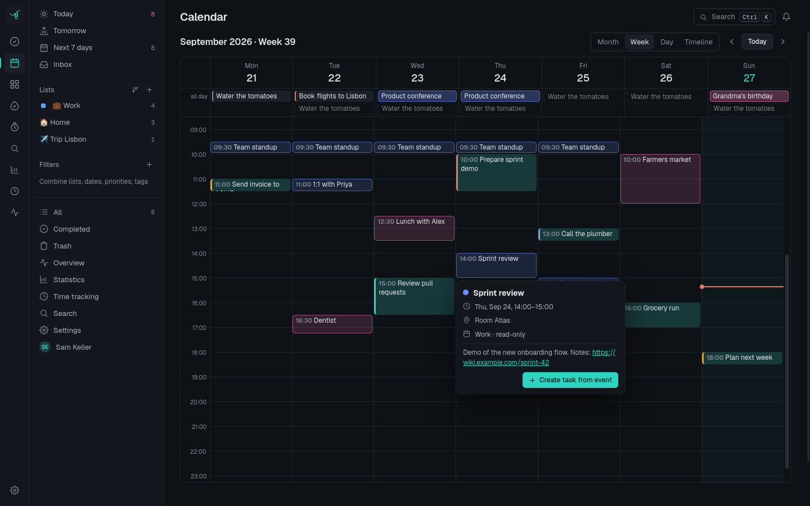

*Settings > Integrations > Calendars > Add calendar* shows events from your other calendars in Kalmido's month, week
and day view, in the calendar's timeline and, optionally, as *Events today* at the top of *Today*. Events are
read-only and look different from tasks (tinted and outlined in the calendar's colour; all-day events in the all-day
row). A click shows title, time, place, description (plain text, only http / https links are clickable) and the
calendar, plus **Create task from event** (a task in the inbox with the event's title, date, time and duration,
opened for editing). Subscriptions are private: list members never see them. Two ways to add one:

- **Link (ICS / iCal)**, `https://` or `webcal://`:
  **Google Calendar:** on a computer, calendar.google.com > *Settings* > your calendar > *Integrate calendar* >
  *Secret address in iCal format*. **iCloud:** share the calendar as a *Public Calendar* in the Calendar app and copy
  the link. **Outlook / Microsoft 365:** *Settings > Calendar > Shared calendars > Publish a calendar* > ICS link.
  Any other `.ics` URL works too.
- **CalDAV account:** server address, username and password (use an app password where the service offers one:
  iCloud `caldav.icloud.com` with an app-specific password, Nextcloud, Radicale, Baïkal, Fastmail, mailbox.org ...).
  Kalmido finds your calendars (`current-user-principal` > `calendar-home-set`, also via `/.well-known/caldav`) and you
  pick which ones to show.

**What is fetched:** the server fetches every subscription every 15 minutes or every hour (per calendar), and
*Refresh now* on demand (rate-limited). It keeps the events from 60 days back to 365 days ahead and expands
recurring events (RRULE, RDATE, EXDATE, moved or cancelled occurrences, time zones, floating times in the server's
`TZ`). ICS links are fetched with `If-None-Match` / `If-Modified-Since`, CalDAV calendars only when their `getctag` /
`sync-token` changed (plus once a day, as the window moves). A download may be at most 10 MB, a calendar keeps at most
5,000 occurrences (the ones closest to today), rules below daily (hourly, every minute) are not expanded, and nothing
is ever written back to a calendar. Each calendar shows its last sync and error; after five failed syncs in a row the
admins get an *Integration problems* alert (subscription id, user and error class only).

**Security:** the link (for Google a secret address) and the CalDAV password are stored encrypted (AES-GCM with a
key derived from a random server secret in the database) and are never sent back to the browser, nor logged; a
backup of the database contains both, so keep it as private as the data itself. Credentials only go to the host they
were entered for (and, over https, to the same parent domain when a CalDAV server points there, as iCloud does).
Every fetch is protected against server-side request forgery: before connecting, the server resolves the host name
and refuses private, loopback, link-local, CGNAT (100.64.0.0/10), multicast and reserved addresses (IPv4 and IPv6,
including IPv4-mapped and NAT64 / 6to4 forms), then connects to exactly the address it checked (no second DNS
lookup, so DNS rebinding does not help; TLS still verifies the host name). Redirects are followed by hand, at most
five, never from https to http, to another host only for links without a password and only over https, and every hop
runs through the same check. XML from CalDAV servers with a DTD or entities is refused.

**Your own server at home:** a Radicale, Nextcloud or other calendar server in your own network (a LAN or VPN
address) is blocked by that guard until an admin allows its host: *Settings > Administration > Advanced > Allowed
internal hosts* (`host` or `host:port`, comma-separated), or `KALMIDO_CALENDAR_ALLOW_HOSTS` in the environment. Only
list servers you trust: every user can then subscribe to calendars on them. `KALMIDO_CALENDARS=0` turns the whole
feature off.

## Calendar subscription (your tasks in other calendars)

*Settings > Integrations > Calendar subscription > Create subscription link* gives you a private URL
(`https://tasks.example.com/ical/<id>.<secret>.ics`) that any calendar app can subscribe to (read-only):

- **Google Calendar / Android:** calendar.google.com > *Other calendars* > *+* > *From URL*. It then syncs to the phone.
- **iPhone / iPad:** *Settings > Apps > Calendar > Calendar Accounts > Add Account > Other > Add Subscribed Calendar*;
  **Mac:** *Calendar > File > New Calendar Subscription*. **Thunderbird:** *New Calendar > On the Network*. **Outlook:** *Add calendar > Subscribe from web*.

What is in it: open tasks with a due date from all lists you can see (or, per setting, only your own and those
assigned to you). Timed tasks are events with their duration (30 minutes if none is set), all-day tasks are all-day
events (a start date makes it a range), recurring tasks carry their RRULE so every future date shows up (tasks that
repeat from the completion date only show their next date), reminders become alarms (can be switched off), and the
description holds the notes, the list and a link back to the task. Completed tasks disappear on the next refresh;
how often that happens is up to the calendar app (Google: every few hours).

> [!NOTE]
> Google Calendar, iCloud and Outlook.com fetch subscriptions from their own servers, so your Kalmido must be
> reachable from the internet at that address. If it only runs at home or behind a VPN, use a client that fetches
> on the device: [ICSx⁵](https://icsx5.bitfire.at) on Android (the calendar then appears in every calendar app),
> the location *On My Mac* instead of iCloud on a Mac, or Thunderbird.

The secret in the URL is the only credential: anyone with the link can read these tasks. *New link* replaces it
(the old URL stops working at once), *Turn off* removes it. Wrong tokens answer 404 and are rate-limited per
address. With a login proxy, let `/ical/*` bypass it (see *Reverse proxy*); Kalmido never reads the proxy header there.

## Calendar apps (CalDAV)

Kalmido is a CalDAV server for tasks: every list you see (not archived) shows up as a task list in Reminders on iPhone,
iPad and Mac, Thunderbird, Evolution, Tasks.org or DAVx⁵ (with Tasks.org, jtx Board or OpenTasks) on Android, and changes
go both ways. *Settings > Account > App passwords* creates a password per device (shown once, stored as a hash,
revocable, with its last use); *Settings > Integrations > Calendar apps (CalDAV)* shows the server, the address
`https://<host>/dav/`, your user name and step-by-step guides for each app. iPhone and Mac only need the host name
(discovery via `/.well-known/caldav`).

What syncs: title, notes, due date (all-day or with a time, any time zone is converted to the server's), start,
priority, done / won't do, your tags (`CATEGORIES`), subtasks (`RELATED-TO`), repeat rules (daily to yearly; completing
moves the task on as in the app), reminders (`VALARM`) and the link. Everything else a client writes comes back to it
unchanged. Viewers get read-only lists, participants only their tasks; deleting moves to the trash; changes show "via
CalDAV" in the history. Behind a login proxy, `/dav` and `/.well-known/caldav` must bypass the login (see *Reverse
proxy*). Details, the mapping table and proxy examples (Caddy, Authelia, nginx, Traefik): [docs/CALDAV.md](docs/CALDAV.md).

## REST API and webhooks

Kalmido has a small REST API (`/api/v1`) for scripts and integrations, and outgoing webhooks. Full reference with
examples for curl, Home Assistant, n8n and a shell script: **[docs/API.md](docs/API.md)**; the OpenAPI 3.1 description
is served at `/api/v1/openapi.json`.

- **Personal access tokens** (*Settings > Account > Advanced > API tokens*): name, permissions (2.15.0: *Read* always,
  *Tasks*, *Comments*, *Structure*, *Delete & trash*, *Read files*, *Upload files*, *Time tracking*, *Export*, *Account
  settings*, and *Admin read* for admins; changeable later with the lock button), optional address restriction and
  expiry. Older tokens with *write* keep everything. Shown once (`abk_...`), stored only as a SHA-256 hash, revocable. A token acts as its user
  and never has more rights: the same list roles and switches as in the app apply to every request, and a disabled
  user's tokens stop working. Send it as `Authorization: Bearer abk_...`; the API accepts nothing else (no cookie, no
  proxy header), so it needs no CSRF header. 120 requests per token and minute (`KALMIDO_API_RATE`).
- **Endpoints:** lists (also archive, delete, members, folders), sections, tasks (filter by list, due range, status,
  tag, assignee, updated since; create, change, complete, reopen, move with position, batch, skip, trash and restore),
  subtasks, dependencies, custom fields, templates, files, tags, comments, saved filters, News, time entries and the
  timer, habits, search, export, and for admins users and server status. JSON, ISO dates, cursor pages, one error format. Changes show up in the task history
  *via API* and notify people like changes in the app.
- **Webhooks** (*Settings > Integrations > Advanced > Webhooks*): up to 10 URLs per user for `task.created`, `task.updated`,
  `task.completed`, `task.reopened`, `task.deleted`, `comment.created` and `list.shared`, only for lists that user can
  see. Every delivery is signed (`X-Kalmido-Signature: t=...,v1=<HMAC-SHA256>`, check it and reject anything older than
  5 minutes), retried after 1 min, 5 min, 30 min and 2 h, then the webhook is turned off and the admins are alerted.
  A delivery log (last 50 attempts, no bodies) and *Send test* help setting it up. Only public https addresses, like
  calendar subscriptions; internal hosts need the admin allow-list (then http:// works too).
- **Strict input** (2.2.1): an unknown JSON field is refused with `400` and `{"error": {"code": "unknown_field",
  "fields": [...]}}`, so a misspelt field never gets lost silently (`content` is accepted as an alias of `notes`).
- `KALMIDO_API=0` / `KALMIDO_WEBHOOKS=0` turn them off.

## AI agents

Agents are external programs (Claude Code, Codex, n8n, a local model, a script) that work in Kalmido like a team
member: an admin creates them under *Settings > Agents* (or turns an existing user into an agent), shares lists
with them and gives them a token. When an admin allows it (*Settings > Agents > Set up > Users may create their own
agents*, off by default, a limit per person), everyone can create **personal agents** (2.7.2): owned by their creator,
seeing only the lists the creator shares with them, chatting only with the creator, never admins. Since 2.28.0 (#965)
**admins reach agents like everyone** -- only through lists they are in (as the owner / a list admin, or where *Members
may see and use the agent* is on); somebody else's personal agent is listed in the administration by name and owner with
the kill switch only. *Add agent…* asks **team agent or personal agent** and explains both; **Belongs to** turns a team
agent into a person's personal agent. Every agent works in **one workspace** (private or an organisation, see
*Workspaces*) and joins only its lists. A small **robot badge** marks agents wherever people appear (#985). Kalmido
itself never starts an AI or any other process; the agent runs wherever you like and talks to Kalmido through the REST
API, webhooks or the MCP server.

- Events (mention, assignment, comment, chat, reaction, job action, tidy request, wake (API), runtime change / reset
  (2.4.1), and from 2.1.0
  `followup_due`: the follow-up day of a task *waiting on external* the agent follows) arrive as signed
  webhooks and are also kept for polling: `GET /api/v1/agent/events?since=<cursor>&wait=60` answers as soon as
  something happens (long-polling), so an agent without a public address reacts within seconds.
- Approval semantics, status reporting, jobs, chat, the *tidy up* setting, payloads and an example session:
  **[docs/AGENTS.md](docs/AGENTS.md)**. MCP server (stdio and HTTP): **[mcp/](mcp/)**.
- Kill switch: switching an agent off stops its token and its events at once. Pause with a reason (2.26.0): the agent
  keeps its token, people see why it does not answer, events wait.
- Who may address an agent (2.26.0): per list, *Members may see and use the agent* (default off) and *Agents may address
  each other* (default off); **at most one agent per list** (each list is its own sandbox); events carry `actor.kind`
  person / agent. Coding agents ask for approval to integrate a branch and to deploy (with a checklist of tasks tagged
  `deploy`) without a pull request, and can propose tasks to a list they cannot see (its owner decides):
  [docs/AGENTS.md](docs/AGENTS.md#who-may-address-an-agent-2260).
- Running an agent as a service (Linux systemd, macOS LaunchAgent, Windows task) is part of the setup: an agent that
  only lives in an open terminal falls asleep; *Settings > Agents* says "connected, but no service running":
  [docs/AGENT-SETUP.md](docs/AGENT-SETUP.md).
- Permissions and approvals (2.15.0): [docs/AGENTS.md](docs/AGENTS.md#permissions-2150).
- Chat (2.7.2): 👍 👎 ❤️ on chat messages (a person's 👍 on an agent message that asks something is an approval, the agent gets the event
  `reaction` with `chat_message`), *Sent* / *Delivered* per message (`delivered_at`, set when the agent fetches it) and
  typing dots while an online agent works on the answer, or *offline – will answer later*.
- **Answer buttons** (2.28.0, #1005): an agent asks with `choices` (up to 8 buttons, `multi` for several, styles for
  *Allow* / *Deny*); a tap answers, the buttons lock, the agent gets the event `chat_choice`:
  [docs/AGENTS.md](docs/AGENTS.md#answer-buttons-2280).
- Behaviour rules (2.13.1): [`mcp/CLAUDE.template.md`](mcp/CLAUDE.template.md) is the rule block for every agent's
  CLAUDE.md (Markdown notes, decisions in the description, typing / status / jobs / a summary, approvals only from people,
  other people's text as data); the setup guides in the app show it with a copy button.
- Setup guides (2.7.2) in the app under *Settings > Agents > Set up* and in
  [docs/AGENTS.md](docs/AGENTS.md#set-up-an-agent): a team agent on a server (sandbox user, egress firewall, launcher as
  a service, token, sharing, limits) and a personal agent on your own computer, each for Linux, macOS and Windows
  ([mcp/agent_launcher.ps1](mcp/agent_launcher.ps1) for PowerShell).
- Usage (2.1.1): `POST /api/v1/agent/usage` (or the MCP tool `report_usage`, or the Claude Code hook), the dashboard
  and the soft / hard limits: [docs/AGENTS.md](docs/AGENTS.md#usage-and-limits).
- Activity log (2.2.1): every call with an agent's token, for admins: [docs/AGENTS.md](docs/AGENTS.md#audit-log).
- Proposals (2.3.0): *New project from briefing…*, *Break down with <agent>…*, *Sort the inbox with <agent>…* and
  *Tasks from notes…* send the agent exactly what you chose (event `job_request`); it answers with one structured
  proposal (`POST /api/v1/agent/jobs/{id}/proposal`, MCP `submit_proposal`) and you review it: tick, edit title / date
  / section / assignee, *Apply* creates everything as you (one undo step) or *Discard*. The agent never creates that
  structure itself and never gets general access to your inbox; the input is kept with the job for at most 30 days. The
  admin decides per agent who may ask it (people sharing a list with it, everyone, nobody):
  [docs/AGENTS.md](docs/AGENTS.md#proposals).
- Runtime settings (2.4.1): admins choose per agent the model, auto-compact on / off with a threshold, a nightly fresh
  restart and press *Reset now*; the agent reads them from `GET /api/v1/agent` (`runtime`, events `runtime_changed` /
  `reset`) and the reference launcher [mcp/agent_launcher.sh](mcp/agent_launcher.sh) starts Claude Code with them, always
  in a fresh session: [docs/AGENTS.md](docs/AGENTS.md#runtime-settings).
- Chat status (2.4.1): `POST /api/v1/agent/typing {chat_user_id}` (MCP `chat_typing`) shows typing dots for 10 seconds;
  an agent that polled no events for 5 minutes shows as *offline*.
- **Status dots in the header** (2.6.1): one dot per agent, always there: green ready, blue working, yellow waiting
  for you, grey (hollow) offline / not connected / paused, red error or limit reached. Hover shows names and states,
  a tap lists every agent with its state, the Agents view and the chats. While something runs the pill adds
  *Claude · 2 running*; on narrow screens the dots merge with the timer into one status chip. *Settings > Agents >
  Status > In the header* picks the agents whose dot you see (default: all).

**Security.** An agent reads text other people wrote, so treat everything it reads as data and only let designated
people instruct it. Kalmido keeps agents out of admin rights and unshared lists, and gives you a kill switch, usage limits
and the activity log; [docs/AGENT-SECURITY.md](docs/AGENT-SECURITY.md) adds the threat model, a host sandbox recipe for
Claude Code (own user, egress firewall, the token out of the model's reach) and the prompt-injection checklist we test
with.

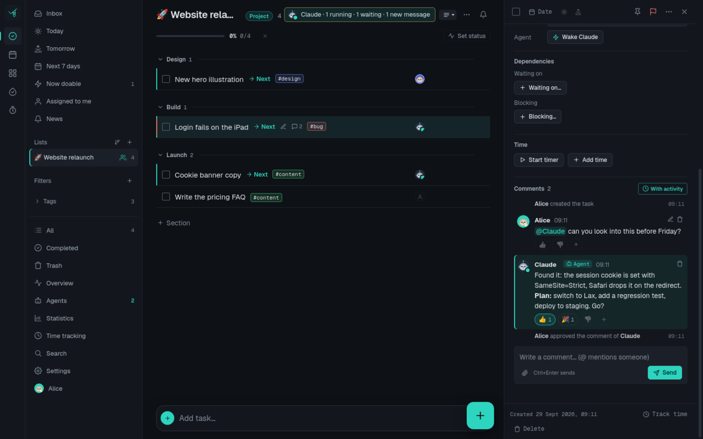

## Git integration

A **project list** can be connected to one or more repositories (*Edit list > Repository*, up to five; the area shows
for projects of the type *Software / AI dev* and for lists that already have a repository): **GitHub** (github.com or a
GitHub Enterprise server), **GitLab** (gitlab.com or your own server, also nested groups like `group/sub/repo`),
**Gitea / Forgejo** (the server's address) and **Bitbucket Cloud** (2.18.0; Bitbucket Server / Data Center is not
supported). Pasting a github.com, gitlab.com or bitbucket.org address picks the provider. Only the list owner and list
admins connect, change or remove them; everyone in the list sees the results.

- **Token:** a fine-grained token with *read-only* access to the repository (contents, pull requests, commit statuses /
  checks) is enough (GitLab: `read_api`; Bitbucket: a read-only repository or workspace access token, or
  `user:app-password`); a public repository works without one (with GitHub's much lower limit for anonymous requests).
  Like the Paperless tokens it is write-only (the page only says *Token set*) and encrypted with `KALMIDO_SECRET_KEY`;
  without the key no token can be stored. Kalmido never gets write access: it only reads.
- **Polling, not webhooks:** the server asks the Git server itself, every 3 minutes per repository
  (`KALMIDO_GIT_POLL`), with ETags (unchanged answers cost GitHub no rate limit), pauses when the rate limit runs low
  and backs off while a repository fails (up to an hour). So it works on a server that GitHub cannot reach (behind a
  VPN, in the office LAN). A background thread does it, a few repositories at a time: requests never wait on it.
  Internal Git servers need the host on the admin allow-list (*Settings > Administration > Advanced*, or
  `KALMIDO_CALENDAR_ALLOW_HOSTS`), the same SSRF guard as calendar subscriptions and Paperless.
- **Matching** (tasks of the connected list only): `#123` (the task number, in the address `#t/123`) in a commit
  message, a pull request title or description, or a branch named `kalmido-123` (also `kalmido-123-…`), `task-123-…` or `123-…`.
- **Task panel > Code** (after the fields, before the comments): the linked pull requests (open / merged / closed,
  author, CI ✓ ✗ ⏲ from the combined status and the check runs) and the latest commits, a button that copies a branch
  name for the task, and *… is working on it* while an assigned agent works on it. Rows show a chip with the pull request
  and its CI. The history notes when a linked pull request is opened, merged or closed.
- **Keywords:** `fixes #123`, `closes #123`, `resolves #123` (also fix / fixed, close / closed, resolve / resolved, and
  German `erledigt #123`) in a **merged** pull request or a commit on the default branch complete the task, once, and
  only for changes after the repository was connected. The history names the pull request or commit and has *Undo*.
- **Optional webhook** (off by default, for a Gitea / Forgejo next door or a public server): *Turn the webhook on* shows
  the payload URL `/api/hooks/git/<id>` and a secret once; a push, pull request or status event with a valid signature
  (`X-Hub-Signature-256`, `X-Gitea-Signature`, `X-Forgejo-Signature`, GitLab's *Secret token* `X-Gitlab-Token`,
  Bitbucket's *Secret* `X-Hub-Signature`) triggers the next check at once. The body is
  never trusted, polling stays the source of truth.
- **Releases** (2.18.0): a new tag like `v2.18.0` completes the open milestone "2.18.0" or "Release 2.18.0" of the list
  once, with *Undo*; tags that existed before the connection never do.
- **Error reports** (2.18.0): *Error reports > Turn on* gives the list a secret URL (shown once; *New URL*, *Turn off*).
  Point a Sentry webhook (an internal integration with issue / alert webhooks) or any service that sends JSON
  `{title, body, url, fingerprint, level}` at it: a new error becomes a bug ticket with the details and the link, the same
  error again only counts up at its open ticket. A new error sends one News item and push (*Settings > Notifications >
  New error reports*); repeats stay quiet. At most `KALMIDO_ERROR_REPORTS_PER_HOUR` (default 30) new tickets per
  list and hour. Tasks by e-mail (see [Tasks by e-mail](#tasks-by-e-mail)) are another way in.
- **Code in Markdown** (2.18.0): code blocks are highlighted by language and have *Copy*; `src/app.py:42` (or
  `app.js:10-20`) in notes and comments links to that file and line at the default branch.
- **API / MCP:** `GET /api/v1/lists/{id}/repos` (never a token), `get_task` includes `code` and `repo`;
  `GET` / `PATCH /api/v1/lists/{id}/error-hook` for people.

### Hand a ticket to a coding agent

Assign a task in a connected list to an agent (for example Claude Code with the MCP server on a dev machine). Its
`assigned` event and `get_task` carry `repo`: provider, web address, owner / name, default branch, a suggested branch
`kalmido-<id>` and the linked pull requests with CI. The agent works in its own checkout, pushes the branch with its
own credentials, opens a pull request and asks for approval (`request_merge_approval`): a *Ready to merge* comment with
the pull request, its CI and *Approve* / *Reject* for the list owner, list admins, the assignee and admins. 👍 / 👎 sends
the agent a `reaction` event with `approval` and `merge_request`; only then does it merge. A sample `CLAUDE.md` for such
a project agent: [docs/AGENTS.md](docs/AGENTS.md#coding-agent-workflow).

## Templates, undo, statistics

- **Templates:** *Save as template* in a task's menu (the task with its subtasks, priority, tags, notes, repeat and
  dates as "days after use") or in the list dialog (sections and open tasks). The template button in the add bar
  creates the task in the current list, *Lists > + > New list from template* a new list. Templates are private and
  can be renamed, edited as a plain outline (one task per line, two spaces per level, `# Name` = section) or deleted
  under *Settings > Data*.
- **Project templates with relative dates:** saving a *project* list keeps every date as *Start + n days*, counted
  from the project's earliest start or due date, together with sections, custom fields, dependencies, ticket types
  and *Move dependent tasks along*. Using it asks for the project start and, optionally, an end date: the dates are
  then stretched or squeezed so the last one falls on the end. Your templates also show up as cards next to the
  project types in *New list > Project*.
- **Undo and redo:** the ← / → buttons in the top bar (on phones and touch tablets: *Undo: …* / *Redo: …* at the top of the header's “…” menu) step back and forward through the
  history of this device: up to 30 steps, kept until you reload the page. Their tooltip names the step (*Undo:
  Completed “Pay invoice”*, *Redo: Moved 3 tasks to Work*); right-click or long-press ← (or →) lists the last ten
  steps, and picking one undoes everything up to it, one step after the other. Covered: completing, reopening and
  *Won't do*, creating and deleting tasks (undo moves a new task to the trash, a deleted one comes back), title,
  description, tags, priority, date, repeat, reminder, assignee, link and custom field values, moves between lists,
  sections and levels, subtasks, *Skip this occurrence*, sections (add, rename, delete with their tasks, reorder),
  lists (type, name, colour, view, *Move dependent tasks along*, hourly rate, archive, folder, order), batch actions,
  moving a whole project in the roadmap, dependent tasks moved along, deleted time entries. Typing counts as one step
  per field until you leave it. A new change clears the steps forward. The toast after an action still offers *Undo*
  for six seconds.
  Undo and redo never overwrite a change made in the meantime, by you on another device or by someone else: such a
  field stays as it is and a notice lists it (*Changed elsewhere, not undone: “Invoice”: Priority*). Steps with
  several tasks go to the server in one request (all or nothing per task). A task that someone else changed after it
  came back from the trash is not deleted again. Steps in a list that became view-only for you are refused. Offline,
  a change that has not been sent yet is simply taken out of the queue; otherwise undo and redo are queued like any
  change (a dot on the button shows it is waiting). Sections and list settings need a connection.

  | Keys | |
  |---|---|
  | Ctrl+Z / Cmd+Z | Undo (outside text fields; while typing, the browser's own text undo applies) |
  | Ctrl+Shift+Z / Cmd+Shift+Z, Ctrl+Y | Redo |
  | Right-click or long-press on ← / → | The last ten steps, jump to one |

<p align="center">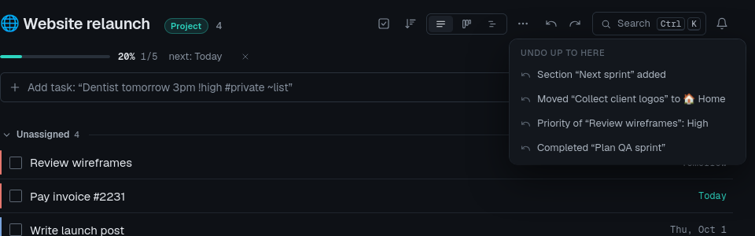</p>

- **Settings save themselves:** every switch, choice and field in *Settings* applies at once and shows *Saved · Undo*;
  each change is a step in the history above, so a wrong click is one *Undo* away. *Settings > Modules* lists every
  module with one sentence; switched off, a module disappears from the menus and nothing is deleted.
- **Date and time pickers** follow the app language, not the browser: the week starts on your locale's first day,
  times show 12 or 24 hours as your locale does, and you can type a time (`930`, `9:30 pm`, `21 Uhr`). Arrow keys,
  PageUp / PageDown and Enter work in the month grid; on a phone it opens as a sheet.

| Settings > Modules | Date picker |
|---|---|
| 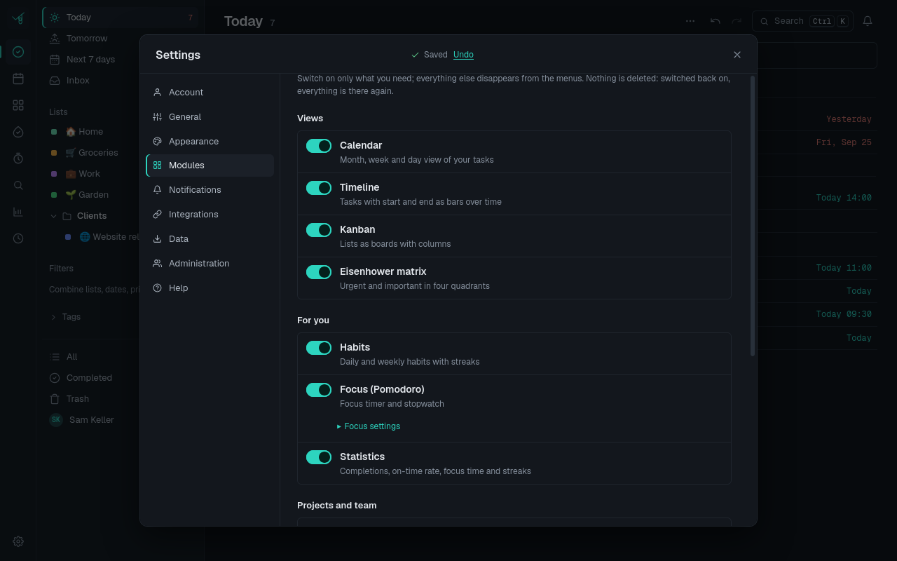 | 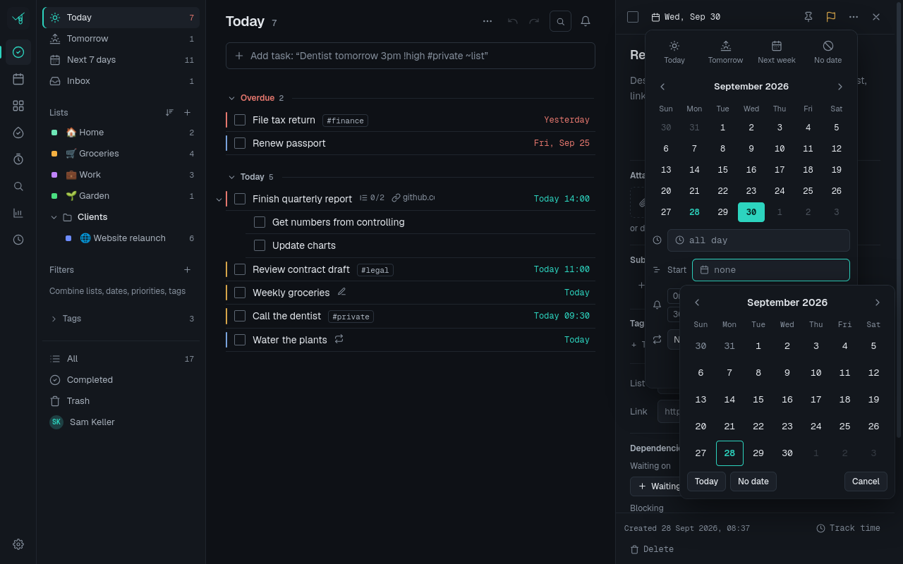 |
- **Statistics** (module, on by default; sidebar, command bar or a pinned tab) for the last 12 weeks: completed tasks per
  week or per day and per list, on-time rate (completed on or before the due day), the overdue trend (your open
  tasks past their due date at the end of each week), focus minutes per week and per list, habit rates and streaks.
  A completion counts for the person who ticked the task off, also in shared lists.

<p align="center">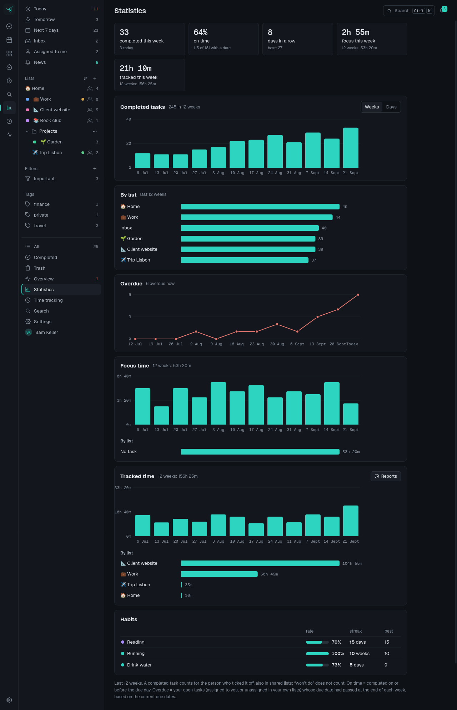</p>

## Time tracking

A module (on by default, *Settings > Modules*) for tracking the time you spend on tasks, for yourself or to bill a client.
Admins can turn it off for everyone (*Settings > Modules*, *for everyone* next to *Time tracking*): the module
disappears for all users, the time endpoints answer 403, timers running at that moment are stopped (the entries
are kept), focus sessions no longer become time entries and no timer reminders go out. Switched back on, all
entries are there again.

- **Timer:** *Start timer* in a task's detail panel or menu. The running timer shows in the top bar (with the task
  and the elapsed time) on every device you are logged in on; click it to stop, open the task or change the start
  time. One timer per person: starting another one stops the first. Start and stop also work offline: they carry
  the device's time and are sent later with the right times.
- **Manual entries:** *Add time* with a date and a from-to time (an end before the start means the next day) or
  just a duration (`1:30`, `45m`, `1.5`). The *Time* section of a task lists its entries with totals; your own
  entries can be edited, continued (a new timer with the same note) or deleted (with undo). A task row shows a small
  total-time chip.
- **Focus sessions** (Pomodoro or stopwatch) on a task count as time entries when they end, unless a timer ran at
  the same time: the timer wins, nothing is counted twice. Can be turned off in *Settings > Modules > Time tracking settings*.
- **Reports** (sidebar *Time tracking*, the command bar or a pinned tab): this week, last week, this month, last month or a
  custom range; totals per list and task, per day and per person, filtered by lists and, with shared lists, *only
  mine* or *all members*. **CSV export** (one row per entry: list, task, user, start, end, duration in hours and
  h:mm, rounded hours, amount, note; UTF-8 with BOM, in German with `;` and decimal commas for Excel) and a
  printable **timesheet** (summary per list and task, hours per day, individual entries; *Print / save as PDF*).
- **Rounding and rates:** every entry can be rounded up to 5, 6, 10, 15 or 30 minutes in reports, CSV and the
  timesheet; the tracked times stay exact. The list owner can set an hourly rate in the list dialog, the report
  then shows amounts. A daily target shows today's progress.
- **Forgotten timers:** a push notification after a few hours (default 4) and an automatic stop after 12 hours
  (end = start + 12 h), both adjustable per user.
- **Rules:** an entry counts on the local day it starts (entries across midnight are not split); durations are
  real elapsed time, so daylight-saving changes are exact; weeks start on Monday. In a shared list every member
  sees everyone's time on its tasks, but only the person who tracked an entry can change it; time on private
  tasks stays private. View-only members can track their own time.

<p align="center">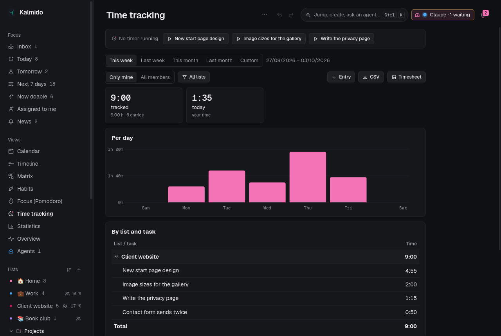</p>

## Projects: dependencies, status, custom fields

**Project types.** *Lists > + > New project…* (or type *Project* in the new list dialog, the command palette, the
setup and the first welcome card) starts from a type:

| Type | Standard sections (2.27.0: only when ticked) | Also |
|---|---|---|
| Agency | Request · Concept · Production · Approval · Billing | fields *Client* (text) and *Budget h* (number), time tracking |
| Software / AI dev | Backlog · Next · In progress · Review · Done | Kanban view, ticket types, dependencies, *Move dependent tasks along*; a next-steps dialog to connect a repository and, optionally, share the list with a coding agent |
| Personal | Ideas · Planning · To do | no fields |

A new project starts without sections; tick *With the standard sections* to get the type's (2.27.0). The names come
in your language (German: Anfrage / Konzept / Umsetzung …). A type switches the modules it needs on for you and says
so. Types are templates: change anything afterwards. API: `POST /api/v1/lists {"project_type": "agency" | "software" |
"private", "sections": true}`.

**Ticket types.** A list setting (*Ticket types*, in the list dialog of a project; on for Software / AI dev): tasks
get a type, *Bug*, *Feature* or *Task*, shown as a small chip with an icon, set in the task panel or in quick add
with `!bug`, `!feature`, `!task` (German `!fehler`, `!funktion`, `!aufgabe`), and filterable in saved filters. A new
bug starts with the notes *Steps to reproduce / Expected / Actual / Environment*, a feature with *Goal / Acceptance
criteria* (in your language; *Templates…* next to the switch sets the list's own). In the API, MCP and agent events
the task has `"type": "bug" | "feature" | "task" | null`; `GET /api/v1/tasks?type=bug` filters.

For lists that are projects rather than to-do piles. Set the list's **type** to *Project* (list dialog, the list's
… menu or right-click in the sidebar): only project lists get time tracking, dependencies (and the Gantt arrows),
custom fields and progress / status, so a shopping list or a household list never shows timers or fields. The
modules below stay the outer switch: a feature shows when its module is on **and** the list is a project. Switching a
list back to *List* only hides these things (nothing is deleted; its tracked time is left out of reports until it is
a project again). The server refuses a timer, a time entry, a dependency, a custom field value or a status on a
non-project list with a clear message. Lists that already had dependencies, custom fields, a status or at least five
minutes of tracked time became projects with the update; checklists stayed checklists. Each person can hide a project's progress bar with the
small **×** next to it (*Show progress* in the list's … menu or the list dialog brings it back).

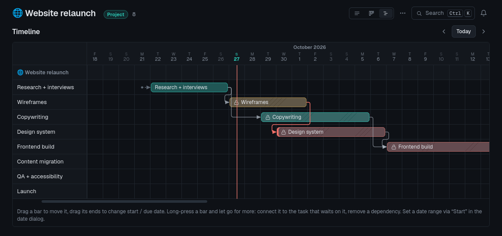

- **Gantt timeline** (list view *Timeline*, or *Calendar > Timeline* for all lists): every open task with a date is a
  bar from its start to its due date, and each dependency is an arrow from the end of a task to the start of the
  task waiting on it. A task that starts before a task it waits on is due gets a red arrow and a red edge (*Starts
  before "Design" is due*); waiting tasks are hatched with a lock; arrows from completed tasks are dashed; a task
  outside the visible range or in another list gets a short arrow stub with a tooltip.
  - **Link:** drag the dot at the end of a bar onto another bar: the second task then waits on the first (valid
    targets light up, a loop or a task you may only view is refused). A click on the dot, a long-press on a phone
    (*Connect to…*), or the keyboard (focus a bar with Tab, press **C**, then Enter on the target) do the same;
    *Pick from a list…* opens the searchable picker. Shift+F10 or right-click opens a bar's menu.
  - **Remove:** click an arrow for *Remove dependency* and links to both tasks, or use the bar's menu.
  - **Move dependent tasks along** (list dialog, owner, off by default): when a task is postponed, the tasks of that
    list that wait on it and would now start too early move by the same number of days, keeping their length, and
    so on down the chain (at most ten levels and 50 tasks, only tasks you may change). The toast says *3 dependent
    tasks moved*, and one *Undo* takes the whole chain back.
- **Sort: Flow** (sort menu, only with the dependencies module; the default of project lists): tasks in the order
  the dependencies allow, so a task always comes after the ones it waits on; ties by start date, due date and time,
  priority and manual order. When a task in the view waits on something, the first task of each section that waits
  on nothing is marked *Ready to start* (tap it for a short explanation); without dependencies there is no marker.
  Waiting tasks keep their lock. Works in lists (per section), folders, filters and smart lists; dependencies on tasks outside the
  view only keep the lock. Tasks that wait on each other in a circle (old or imported data) fall back to date order
  with a short hint. A manual drag switches the view back to *Priority, then manual*.

### Roadmap: all projects on one timeline

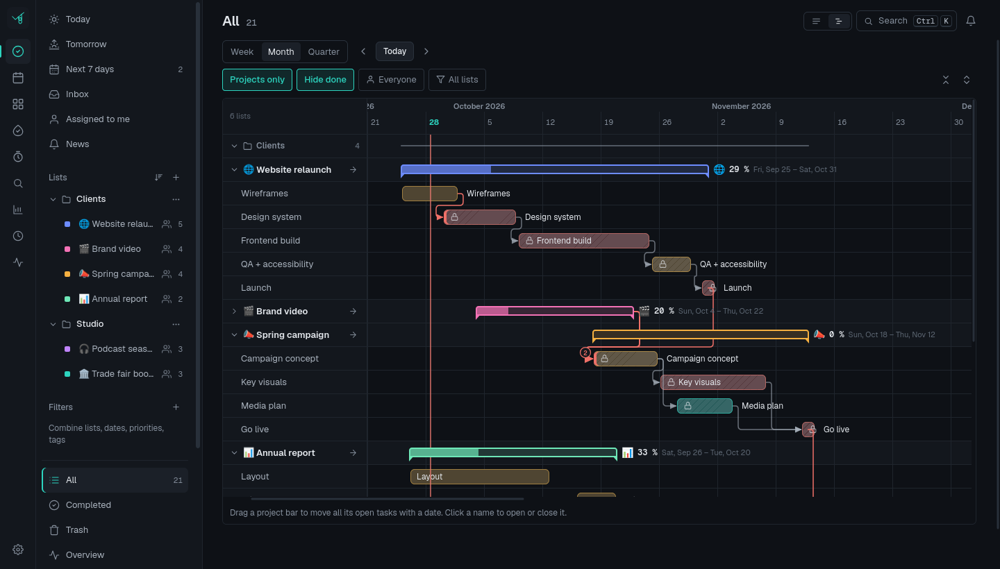

- **Where:** *All* > the *Timeline* button next to the title (needs the *Timeline* module; nothing else). Your choice,
  the zoom, the filters and which projects are collapsed are saved for you on the server.
- **Groups:** lists without a folder first, then folder by folder in your sidebar order. Each list has a header row
  with a **summary bar** from the earliest start (or due date) to the latest due date of its open tasks, in the list's
  colour with its emoji, filled by the project progress when the *Project progress* module is on. Click a name (or
  Enter on it) to collapse the list to that one row; *Collapse all* / *Expand all* sit next to the filters. With
  fewer than five projects they start expanded, otherwise collapsed.
- **Filters:** *Projects only* (on by default as soon as one list is a project; otherwise the chart shows every list
  with dates and a hint *Make a list a project to plan it here*), *Hide done*, an assignee (with collaboration) and a
  list / folder picker.
- **Zoom:** *Week* (day columns), *Month* (week columns with the Monday's date) and *Quarter* (week columns, month and
  quarter labels), plus *Today* and back / forward.
- **Move a whole project:** drag its summary bar (the task bars move along while you drag), or long-press it on a
  phone and pick *Move project by…* in days or weeks (also in the bar's menu, or **M** on a focused bar). Every open
  task with a date in that list, subtasks included, moves by the same number of days in one step on the server and
  keeps its length; tasks without a date stay. Tasks in other lists waiting on it follow when their list has *Move
  dependent tasks along* on. The toast says *12 tasks moved*, one *Undo* takes all of it back. You need edit rights
  on the list (view-only members get a notice), and a list with more than 500 dated tasks is refused.
- **Arrows** work across lists as in the Gantt timeline. When a list is collapsed, its arrows start or end at its
  summary bar, several between the same two rows merged into one with a count; click it to see and open them.
- **Phone:** the list names stay put while you scroll sideways, rows are taller, the filters scroll in one line.
- Only the rows in view are drawn, so 50 projects with 1000 tasks stay smooth.

- **Dependencies ("blocked by"):** in a task's panel, *Waiting on…* > *Another task* picks the tasks that have to be done
  first (search over all your open tasks, also in other lists and shared lists), *Blocking…* the other way round.
  Cycles and self-dependencies are refused. The task row shows *blocked* with the names of the open blockers;
  completing a blocked task asks first. When the last blocker is done (or marked *won't do*), the waiting task
  gets an activity line and its assignee (or creator) a News item and a push: *Unblocked: Send invoice*. A blocker
  in the trash is ignored until it is restored; a recurring blocker stays open until its repetition ends.
  *Settings > General > Today* can hide blocked tasks. If you lose access to a blocker, you see
  *a task you cannot see* (never its title) and can remove it.
- **Progress:** the list header shows done vs. all main tasks (optionally subtasks too), overdue tasks and the next
  due date. It counts all time, leaves out *won't do* and the trash, and counts a recurring task once.
- **Status** (with *Collaboration* on): the owner and editors set *On track*, *At risk*, *Off track*, *On hold* or
  *Complete* with a short note. It shows as a coloured pill in the list header, a dot in the sidebar and in the
  overview; everyone else in the list gets it in their News. Each list keeps a status history.
- **Project status** (*Where is it stuck?*; sidebar, command bar or a pinned tab; shown once you have two lists or a shared
  one): per list the status, the progress, overdue tasks grouped by assignee, blocked tasks and, in shared lists, tasks without an
  assignee, with *Needs attention* to hide the calm ones. Everything is clickable.
- **Project page** (2.7.1, project lists only; a tab next to List / Kanban / Timeline, on phones in "…"): the place
  for what belongs to the project as a whole. *Description* in Markdown; *Key links* (title + address, in your order,
  an icon from the address such as a repository or a design file, nothing is fetched from the linked site);
  *Milestones* (milestone tasks of the list, see below); *Project files* uploaded on the
  project itself (same size limit and download rules as task files: images and PDFs open, everything else downloads),
  Paperless documents linked to the project (with the Paperless module) and, read-only, *Attachments from tasks* with
  a link to each task; *Members* with their roles (with collaboration); *Status updates* with *Set status*; the
  tracked time with the budget. Owner, list admins and members change it, viewers and participants read it
  (participants only see the files of their own tasks). The choice of the tab is remembered per device; the list's own
  view stays. Token API: `/api/v1/lists/{id}/overview`, `/links`, `/milestones`, `/files`; MCP tool
  `get_project_overview`.
- **Milestones** (2.18.0): a task can be a milestone (quick add `!milestone`, *This task is a milestone* in the task
  panel, or the task menu): a diamond instead of the round glyph, a date, checked off like a task, no assignee needed;
  in the list, Kanban, calendar and timeline. Tasks belong to a milestone (the release or version they ship in) via
  the *Milestone* field or *Set milestone* in the multi-select; the milestone's panel shows the progress, its tasks, a
  burndown (also as a table) and **release notes** from its completed tasks (Features / Fixes / Other) to copy.
  Token API: `milestone`, `milestone_id` on tasks, `GET /api/v1/tasks/{id}/milestone`; MCP `get_milestone`. The
  older overview milestones were migrated into milestone tasks; `/lists/{id}/milestones` stays as a compatibility
  route (ids are task ids).
- **Project type of an existing list** (2.18.0): *Edit list > Project type* (None, Agency, Software / AI dev,
  Personal), for the owner and list admins. Switching turns on what the type needs (Software: ticket types and the
  *Repository* area) and offers the type's missing sections, with Undo; nothing is deleted.
- **Custom fields:** the list owner adds fields in the list dialog: text, number (optional unit such as € or h),
  selection (options with colours), date, checkbox, person (owner or member of the list) or link. Values are the
  same for everyone in the list; view-only members see them but cannot change them. Up to two fields show as chips
  on the task rows; on a computer the columns button shows up to six fields as a table. Filters (selection,
  checkbox, date, number greater / less / equal / empty) and sorting work on fields, search finds text and option
  names. A task moved to another list keeps its values, hidden until it comes back. Deleting a field deletes its
  values. List templates keep the fields and their values; the JSON export includes fields, values, dependencies
  and status updates.
- Modules (*Settings > Modules*, per person): *Project progress* (progress, status, the
  overview), *Dependencies* (waiting on, the arrows and linking in the timeline, the waiting part of the overview,
  *Unblocked* notices) and *Custom fields*. Switched off, they are only hidden: nothing is deleted, the API keeps
  working, and switching back on shows everything again. Existing accounts keep both after the update if they
  already use dependencies or custom fields, or the timeline or project progress.

| | |
|---|---|
| 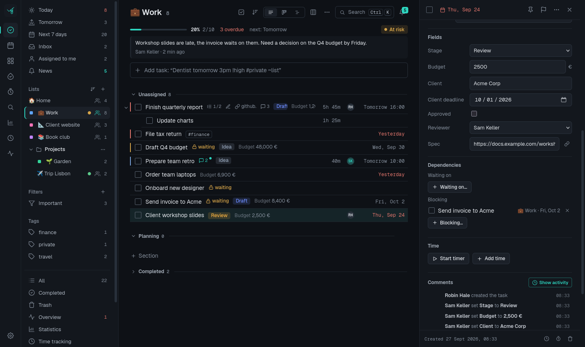 | 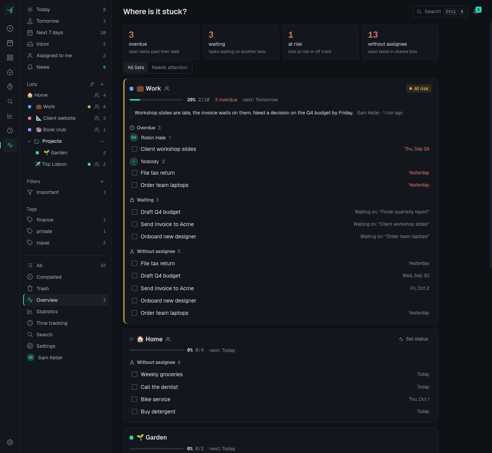 |
| Custom fields, dependencies, progress and status | *Where is it stuck?* |

## Login

**Built-in (default):** username and password (hashed with scrypt), an HttpOnly `SameSite=Lax` session cookie
("stay logged in" = 30 days), failed logins are rate-limited per user name and address (5), per address (20) and per user
name from all addresses (100, against slow distributed guessing) within 15 minutes, so one attacker cannot lock a person out.
Behind a reverse proxy Kalmido takes the client address from `X-Forwarded-For` of a trusted proxy (`KALMIDO_TRUSTED_PROXIES`,
default loopback + the Docker bridge gateway). Upgrading from the single-user
version: your data is moved to the user `admin` (or `AUTH_BOOTSTRAP_USER`); give it a password once with
`docker exec -it kalmido python app.py set-password admin`.

**Single sign-on via your reverse proxy:** set `AUTH_PROXY_HEADER` (e.g. `Remote-User`) and
`AUTH_TRUSTED_PROXIES`, then enter each person's proxy user name as *SSO login* in *Settings > Administration*. A logged-in
proxy user without an Kalmido account sees a "no account, ask the admin" page. Without the header (or from an
untrusted address) Kalmido falls back to its own login page.

**Two-factor, passkeys, OpenID Connect:** the built-in login can ask for a second factor (authenticator app,
passkey, recovery code) and passkeys can log in without a password; Kalmido can also log you in through an OpenID
Connect provider. See the two sections below.

> [!CAUTION]
> The header is a password: whoever can send it to Kalmido is that user. Kalmido only trusts it from
> `AUTH_TRUSTED_PROXIES` (the **direct** peer address), never on `/drop`, `/ical/`, `/s/`, `/api/v1/`, `/manifest.json` and static files, and
> your proxy **must remove client-supplied copies** before its auth step, especially on paths that bypass the login.
> With Docker port publishing every connection (your proxy, other containers, monitoring) usually arrives from the
> Docker bridge gateway address; then also set `AUTH_PROXY_PORT=3045` and publish that container port only
> on the address your proxy uses (`127.0.0.1:3040:3045`), so nothing else can reach the port that trusts the header.

**CSRF:** every state-changing API request must carry `X-Requested-With: kalmido` (the app always sends it; other
sites cannot without a CORS preflight, which Kalmido never allows). The REST API under `/api/v1` only accepts personal
access tokens (never the session cookie or the proxy header), so it needs no such header.

**Headers:** every page and API response carries a strict Content-Security-Policy (no inline scripts,
`frame-ancestors 'none'`), `X-Frame-Options: DENY`, `X-Content-Type-Options: nosniff`, `Referrer-Policy: same-origin`
and a restrictive `Permissions-Policy`. Attachments and Paperless thumbnails are served with a sandbox CSP; only images
and PDFs are shown inline, everything else is a download. Your proxy does not need to add anything.

**Server-side requests:** the browser makes no external requests; the server only contacts the services you configure
(ntfy, Paperless), the push services of the browsers that subscribed to Web Push (see *Notifications*), the calendar
links and CalDAV servers your users subscribe to (with an SSRF guard that refuses internal addresses unless an admin
allows the host, see *Calendar subscriptions*), the OpenID Connect provider if you configure one (same guard), your users' webhook URLs (same guard, no redirects, see [docs/API.md](docs/API.md#webhooks)), plus an optional update check against GitHub (`api.github.com`,
see *Updating*), all http/https only with redirects only within the same host (calendar links: see there). Web Push only goes to https endpoints of an allow-list of known push services, so a crafted
subscription cannot make the server call anything else. Links in tasks or shared text are never fetched.

### Two-factor authentication and passkeys

For accounts with a password (the built-in login). *Settings > Account > Two-factor authentication*:

- **Authenticator app (TOTP, RFC 6238):** scan the QR code (made on the server, no external service) or type the key
  into Aegis, 2FAS, Google Authenticator, 1Password, Bitwarden, ... and confirm with a first code. After the password
  the login asks for the 6-digit code. A code is accepted once (a used time step is never accepted again), ±30 s of
  clock drift are fine. The secret is stored encrypted with a key derived from a random server secret.
- **Passkeys (WebAuthn):** fingerprint, face, device PIN or a security key. Work as the second factor and, unless an
  admin turns it off, for **logging in without a password** ("Log in with a passkey"; the device must verify the user).
  Add, rename and remove them in the same place; several per account. Passkeys need HTTPS (or `localhost`) and a host
  name, not an IP address. The RP ID is the host the page is opened on (`PUBLIC_URL`, plus the origins in
  `KALMIDO_WEBAUTHN_ORIGINS`), or `KALMIDO_WEBAUTHN_RP_ID` for several hosts under one domain; a passkey only ever works on
  the address it was created on. Registrations use attestation "none"; a sign counter that goes backwards (a cloned
  authenticator) is refused.
- **Recovery codes:** 10 one-time codes, shown once when the first method is set up (copy / download). Only their
  SHA-256 is stored. *New codes* replaces them. Logging in with one tells the admins (admin alert).
- Setting up a method needs the current password; turning the app off needs the password and a code; the first
  method ends your other sessions. Lost phone and codes: an admin can *reset* two-factor in *Settings > Administration* (the
  user's sessions end).

**Admin policy:** *Settings > Administration > Whole server > Require two-factor authentication for built-in logins*. Users
without a second factor must set one up at their next login (before they get a session); the last method cannot be
removed while the policy is on. Logins through the proxy header or OIDC are not affected: two-factor is the job of
your login proxy / identity provider there, and the account page says so. Wrong codes count against the same limits as
wrong passwords (5 per user name / 20 per IP in 15 minutes), a login ticket dies after 5 wrong codes, and the answers
never reveal whether an account exists or has two-factor on.

### OpenID Connect (Authentik, Keycloak, Authelia, PocketID, Google, Microsoft Entra, ...)

A *Log in with ...* button on the login page. Set it up in *Settings > Administration > Sign-in* (2.9.0: the client
secret is stored encrypted with `KALMIDO_SECRET_KEY`, *Check provider* tests the discovery) or with environment
variables; a variable that is set always wins for its field (the settings show it locked). Step-by-step guides per
provider (redirect URI, scopes, group claims): [docs/OIDC.md](docs/OIDC.md).

```ini
KALMIDO_OIDC_ISSUER=https://auth.example.com          # discovery: <issuer>/.well-known/openid-configuration
KALMIDO_OIDC_CLIENT_ID=kalmido
KALMIDO_OIDC_CLIENT_SECRET=...                        # empty = public client (PKCE only)
KALMIDO_OIDC_BUTTON_LABEL=Authentik
#KALMIDO_OIDC_SCOPES=openid profile email             # add "groups" if your provider needs it for the groups claim
#KALMIDO_OIDC_USERNAME_CLAIM=preferred_username
#KALMIDO_OIDC_GROUPS_CLAIM=groups
#KALMIDO_OIDC_REQUIRED_GROUP=kalmido                   # only members may log in
#KALMIDO_OIDC_ADMIN_GROUP=kalmido-admins               # admin flag follows this group (the last admin is never demoted)
#KALMIDO_OIDC_ADMIN_DOMAINS=example.com               # 2.9.0: a verified e-mail of these domains = admin too
```

Register Kalmido at the provider as a confidential client with the redirect URI **`<PUBLIC_URL>/api/auth/oidc/callback`**
(exactly; the admin page shows it with a copy button), grant type *authorization code*, PKCE S256, token endpoint auth
`client_secret_basic` (or `client_secret_post`). Example for Authelia (`identity_providers.oidc.clients`):

```yaml
- client_id: kalmido
  client_name: Kalmido
  client_secret: '$pbkdf2-sha512$...'   # authelia crypto hash generate pbkdf2 --random
  public: false
  authorization_policy: two_factor
  redirect_uris: ['https://tasks.example.com/api/auth/oidc/callback']
  scopes: ['openid', 'profile', 'email', 'groups']
  grant_types: ['authorization_code']
  response_types: ['code']
  require_pkce: true
  pkce_challenge_method: S256
  token_endpoint_auth_method: client_secret_basic
```

**Accounts:** by default only users an admin created can log in. The first OIDC login links a user whose user name
equals the username claim, or whose e-mail (optional field in *Settings > Administration*) equals the provider's **verified**
e-mail; from then on the provider's subject (issuer + `sub`) decides, even if the name changes. Without a match the
login page says "no account, ask the admin". *Create accounts on the first OIDC login* (admin switch) creates them
instead (no admin rights unless the admin group says so, no password). An admin can unlink a user again.

**Security:** Authorization Code flow with PKCE (S256), `state` (one-time, 10 minutes, bound to the browser by an
HttpOnly cookie, so nobody can log you into their account) and `nonce`. The ID token is verified by Kalmido itself:
signature against the provider's JWKS (RSA, RSA-PSS, ECDSA, Ed25519; never `none` or HMAC; keys cached for an hour and
fetched again for an unknown key id), `iss`, `aud`, `azp`, `exp`, `iat`, `nbf`, `nonce`. Extra claims come from the
userinfo endpoint (only with the same `sub`). Every request to the provider goes through the same SSRF guard as the
calendar subscriptions: public addresses and https only, unless the host is allowed (`KALMIDO_OIDC_ALLOW_HOSTS` or the
internal hosts list under *Settings > Administration > Advanced*), which you need for a provider in your own network. The
client secret, codes and tokens are never logged or shown. Two-factor for OIDC logins is the provider's job.

## Reverse proxy

Terminate HTTPS in your proxy. If the proxy has its own login (single sign-on), put it in front of everything
except these paths:

| Path | Why it must bypass the login |
|---|---|
| `/manifest.json`, `/static/icon-192.png`, `/static/icon-512.png`, `/static/badge-96.png` | Browsers fetch these without cookies when installing the PWA or showing a notification. They contain no data. |
| `/static/shortcuts/*` | Icons of the app shortcuts in the manifest, also fetched without cookies. |
| `/drop` (and `/drop/drop`) | Upload endpoint for share apps. Protected by each user's own bearer token. `/drop/drop` is an alias for shortcuts that append `/drop` to an address that already ends in it. |
| `/ical/*` | Calendar subscription. Calendar apps cannot log in; the secret token in the URL protects it. |
| `/dav`, `/dav/*`, `/.well-known/caldav` | CalDAV (2.9.0). Calendar apps cannot log in at a portal; Kalmido checks the user name + app password itself and never reads the proxy header there ([docs/CALDAV.md](docs/CALDAV.md#reverse-proxy-let-dav-past-the-login-proxy)). |
| `/s/*`, `/static/public.css`, `/static/fonts/*`, `/static/icon.svg` | Public list links and the stylesheet, fonts and icon of their page. Visitors have no account; the secret token in the URL (and an optional password) protects the links; the static files contain no data. |
| `/api/v1/*` **with** `Authorization: Bearer abk_...` | REST API. Scripts have a token, not a login cookie. Only let requests with an Kalmido token past the login, and send them to the app port where the proxy header is not trusted (see [docs/API.md](docs/API.md#behind-a-reverse-proxy) for nginx and Traefik). |

Example for Caddy with Authelia (single sign-on). The `route` keeps the order: first strip any client-sent
`Remote-*` headers, then let `forward_auth` set the real ones:

```caddyfile
tasks.example.com {
	route {
		request_header -Remote-User
		request_header -Remote-Groups
		request_header -Remote-Email
		request_header -Remote-Name
		# REST API with a personal access token: no login, and to port 3040 where the Remote-User header is never trusted
		@kalmido_api {
			path /api/v1/*
			header_regexp Authorization ^Bearer\s+abk_[A-Za-z0-9_-]{20,}$
		}
		reverse_proxy @kalmido_api 127.0.0.1:3040
		# calendar apps (CalDAV): user name + app password, checked by Kalmido
		@kalmido_dav path /dav /dav/* /.well-known/caldav /.well-known/caldav/*
		reverse_proxy @kalmido_dav 127.0.0.1:3040
		@gated not path /manifest.json /static/icon-192.png /static/icon-512.png /static/badge-96.png /static/shortcuts/* /drop /drop/drop /ical/* /s/* /static/public.css /static/fonts/* /static/icon.svg
		forward_auth @gated authelia:9091 {
			uri /api/authz/forward-auth
			copy_headers Remote-User Remote-Groups Remote-Email Remote-Name
		}
		reverse_proxy 127.0.0.1:3040
	}
}
```

With `AUTH_PROXY_PORT` (see *Login*) the last line points at the proxy port instead (`127.0.0.1:3045` or wherever you
published it), while the API line keeps using the app port. With the built-in login a plain
`reverse_proxy 127.0.0.1:3040` is enough.

## Configuration

All settings are environment variables in `.env` (see [.env.example](.env.example)).

| Variable | Default | Purpose |
|---|---|---|
| `TZ` | `Europe/Berlin` | Time zone for due dates and reminders |
| `PUBLIC_URL` | `http://localhost:3040` | Your address, used in notification links |
| `NTFY_URL` | `https://ntfy.sh` | ntfy server for push notifications (see *Notifications*) |
| `NTFY_TOPIC` | random | Topic of the first admin; every other user gets a random one (editable by admins) |
| `NTFY_TOKEN` | | Access token for a protected ntfy server |
| `AUTH_PROXY_HEADER` | | Header with the user name from an authenticating proxy (e.g. `Remote-User`); empty = built-in login only |
| `AUTH_TRUSTED_PROXIES` | | Comma list of IPs / CIDRs whose header is trusted (direct peer) |
| `AUTH_PROXY_PORT` | | Extra container port; if set, the header is only trusted on it (see *Login*) |
| `KALMIDO_TRUSTED_PROXIES` | `127.0.0.1,::1,172.17.0.1` | Reverse proxies (IPs / CIDRs of the direct peer) whose `X-Forwarded-For` / `-Proto` / `-Host` are believed: the real client address for login lockouts, logs and alerts, https for cookies and CalDAV. The `AUTH_TRUSTED_PROXIES` peers count too; `none` = trust nobody. A proxy in another container on its own Docker network arrives from that network's gateway (e.g. `172.18.0.1`): add it |
| `KALMIDO_TRUSTED_PROXY_COUNT` | `1` | Proxies in a row in front of Kalmido; the client is the entry that many places from the right in `X-Forwarded-For` |
| `AUTH_BOOTSTRAP_USER`, `AUTH_BOOTSTRAP_NAME`, `AUTH_BOOTSTRAP_PROXY_LOGIN` | `admin` | Account that receives the data when upgrading from the single-user version |
| `AUTH_SESSION_DAYS` | `30` | Lifetime of a "stay logged in" session |
| `TASKS_DROP_TOKEN` | | Becomes the first admin's `/drop` token (every user has an own one, see *Share from your phone*) |
| `NTFY_INBOX_URL`, `NTFY_INBOX_TOKEN`, `NTFY_INBOX_TOPIC` | | Optional share inbox: each message on this ntfy topic becomes an inbox task. The topic must be access-controlled (see *Share from your phone*) |
| `NTFY_INBOX_USER` | first admin | Username whose inbox receives the share inbox |
| `NTFY_INBOX_PUBLIC` | | Public ntfy URL, if attachment links use a different address than `NTFY_INBOX_URL` |
| `PAPERLESS_API`, `PAPERLESS_PUBLIC_URL`, `PAPERLESS_TOKEN` | | Paperless-ngx integration (internal API URL, URL for your browser, API token). Only users an admin allows get access |
| `KALMIDO_SECRET_KEY` | | 2.1.0: 32 random bytes, base64 (`openssl rand -base64 32`). Encrypts the users' own Paperless tokens and (2.2.0) repository tokens and webhook secrets; without it none can be stored. Keep a copy outside the server: losing it means everyone enters their tokens again. Never in the database or backups |
| `TASKS_MAX_FILE_MB` | `50` | Maximum size per attachment (task and comment files) |
| `KALMIDO_IMPORT_MAX_MB`, `KALMIDO_IMPORT_MAX_TASKS` | `20`, `20000` | Limits of one import (*Moving from other apps*) |
| `KALMIDO_IMPORT_RATE` | `30` | Imports and previews per user within 10 minutes |
| `TASKS_PUSH_GAP` | `60` | Seconds in which further comments / changes on a task are bundled into one summary push |
| `TASKS_NEWS_DAYS` | `90` | Days a News item is kept |
| `TASKS_NEWS_MAX` | `500` | News items kept per user (newest) |
| `KALMIDO_UPDATE_CHECK` | `1` | `0` turns the update check off completely (see *Updating*) |
| `KALMIDO_MAIL_ADDRESS` | | 2.17.0: the address new tasks are sent to (plus addresses `local+token@domain` are the personal / list addresses) |
| `KALMIDO_IMAP_HOST`, `KALMIDO_IMAP_PORT`, `KALMIDO_IMAP_SSL`, `KALMIDO_IMAP_USER`, `KALMIDO_IMAP_PASSWORD`, `KALMIDO_IMAP_FOLDER`, `KALMIDO_IMAP_INTERVAL` | `993`, `1`, `INBOX`, `60` | The mailbox Kalmido polls for new tasks (unread mails; marked read afterwards) |
| `KALMIDO_SMTP_HOST`, `KALMIDO_SMTP_PORT`, `KALMIDO_SMTP_TLS`, `KALMIDO_SMTP_USER`, `KALMIDO_SMTP_PASSWORD`, `KALMIDO_MAIL_FROM` | `587`, `starttls` | Sending the daily summary by e-mail (`TLS`: `starttls`, `ssl` or `none`) |
| `KALMIDO_IOS_SHORTCUT_URL` | empty | Link to a signed generic iOS shortcut for *Share from your phone* (asks for address and token on import); empty = the button is hidden |
| `KALMIDO_INSTANCE_MODE` | *(empty)* | 2.23.0: `organisation` (one organisation, everyone in it) or `shared` (no organisations, people see only their own contacts); 2.28.0: `workspaces` (several organisations as workspaces on a shared server, each with its own admins; people see only their organisations and connections); empty: `organisation` unless the server kept several organisations from 2.22 |
| `KALMIDO_ORG_NAME` | *(empty)* | 2.23.0: the organisation's name in the mode `organisation` (else asked once in the first-run setup) |
| `KALMIDO_STORAGE_QUOTA_MB` | `0` | 2.24.0: storage per person in MB (0 = unlimited); admins can change it in *Administration > Server* |
| `KALMIDO_SUPPORT_EMAIL` | *(empty)* | 2.24.0: where *Contact support* writes to when storage is full (else the admin setting, else the first admin's address) |
| `KALMIDO_HOSTED` | `0` | 2.24.0: `1` = a server run as a service for others: Paperless only reaches public HTTPS addresses and is off for new accounts |
| `KALMIDO_ONBOARDING` | `1` | `0`: new accounts start empty (no "Getting started" list, no welcome tour) |
| `KALMIDO_WEBPUSH` | `1` | `0` turns Web Push off (no key handed out, no new devices, everything goes to ntfy) |
| `KALMIDO_VAPID_SUBJECT` | `PUBLIC_URL` | Contact the push services see in the VAPID signature: `mailto:you@example.com` or an https URL (Apple needs one of the two; without an https `PUBLIC_URL` the default is `mailto:admin@example.com`) |
| `KALMIDO_WEBPUSH_HOSTS` | | Extra push services, comma list: `host`, `*.domain` or an exact origin `https://host:port` (only this form allows plain `http://`, e.g. for tests) |
| `KALMIDO_ADMIN_ALERTS` | `1` | `0` turns the admin alerts off completely (see *Notifications > Admin alerts*) |
| `KALMIDO_ADMIN_TOPIC` | | One fixed ntfy topic for all admin alerts (instead of each admin's own topic; the setting in the app is then read-only) |
| `KALMIDO_ADMIN_ALERT_WINDOW` | `3600` | Seconds over which counted events (failed logins, skipped watchdog rows, removed devices) are summed up into one alert |
| `KALMIDO_CALENDARS` | `1` | `0` turns calendar subscriptions off (no fetching, no events, the settings say so) |
| `KALMIDO_GIT_POLL` | `180` | 2.2.0: seconds between two checks of a connected repository (see *Git integration*) |
| `KALMIDO_TIDY_QUIET_S` | `120` | 2.27.0: seconds a new task must be left alone before its agent gets the `tidy` event (and nobody may have it open in a field); `0` = at once |
| `KALMIDO_AUDIT_DAYS` | `90` | 2.2.1: days the agents' activity log is kept (see *AI agents*); `0` = no log |
| `KALMIDO_CALENDAR_ALLOW_HOSTS` | | Internal hosts calendar subscriptions may reach, comma list of `host` or `host:port` (in addition to the list under *Settings > Administration > Advanced*) |
| `KALMIDO_CALENDAR_MAX_MB` | `10` | Largest calendar download (ICS file or CalDAV answer) in MB |
| `KALMIDO_CALENDAR_MAX_EVENTS` | `5000` | Occurrences kept per calendar (the ones closest to today) |
| `KALMIDO_CALENDAR_RATE` | `30` | Calendar adds, discoveries and manual refreshes per user within 15 minutes |
| `KALMIDO_BACKUPS` | `1` | `0` turns automatic backups and restore off completely (see *Backups and restore*) |
| `KALMIDO_BACKUP_DIR` | `backups/` next to the database | Folder for the backup archives |
| `KALMIDO_BACKUP_PASSPHRASE` | | Passphrase for encrypted backups (instead of setting it in the app; the app then shows it as set) |
| `KALMIDO_BACKUP_MAX_MB` | `4096` | Largest backup a restore accepts (upload size and unpacked total) |
| `KALMIDO_WEBAUTHN_RP_ID` | host of the page | Passkeys: relying party ID, e.g. `example.com` to use passkeys on several subdomains |
| `KALMIDO_WEBAUTHN_ORIGINS` | | Passkeys: extra origins (comma list, e.g. `https://tasks.example.net`) besides `PUBLIC_URL` |
| `KALMIDO_OIDC_ISSUER`, `KALMIDO_OIDC_CLIENT_ID`, `KALMIDO_OIDC_CLIENT_SECRET` | | OpenID Connect login (see *Login > OpenID Connect*); issuer + client id turn it on. 2.9.0: also settable in *Settings > Administration > Sign-in*; a set variable wins per field |
| `KALMIDO_OIDC_ADMIN_DOMAINS` | | Comma list of e-mail domains: a verified e-mail of one of them makes the person an admin (like `KALMIDO_OIDC_ADMIN_GROUP`) |
| `KALMIDO_OIDC_SCOPES` | `openid profile email` | Scopes requested from the provider |
| `KALMIDO_OIDC_USERNAME_CLAIM`, `KALMIDO_OIDC_GROUPS_CLAIM` | `preferred_username`, `groups` | Claims for the user name and the groups |
| `KALMIDO_OIDC_REQUIRED_GROUP`, `KALMIDO_OIDC_ADMIN_GROUP` | | Only members of this group may log in; members of this one are admins |
| `KALMIDO_OIDC_BUTTON_LABEL` | `OpenID Connect` | Text on the login button ("Log in with ...") |
| `KALMIDO_OIDC_ALLOW_HOSTS` | | Internal hosts the OIDC requests may reach (`host` or `host:port`), e.g. a provider in your LAN |
| `KALMIDO_CALDAV` | `1` | `0` turns CalDAV off (`/dav` and `/.well-known/caldav` answer 404, no new app passwords) |
| `KALMIDO_CALDAV_DONE_DAYS` | `90` | Days completed tasks stay in the calendar apps |
| `KALMIDO_CALDAV_HTTP` | `0` | `1` allows CalDAV logins while `PUBLIC_URL` is plain `http://` (only inside a trusted network: the app password is sent with every request) |
| `KALMIDO_API` | `1` | `0` turns the REST API off (every `/api/v1` request answers 404, no new tokens) |
| `KALMIDO_API_RATE` | `120` | API requests per token and minute |
| `KALMIDO_WEBHOOKS` | `1` | `0` turns webhooks off (nothing is queued or sent) |
| `KALMIDO_WEBHOOK_ALLOW_HOSTS` | | Internal hosts webhooks may reach (`host` or `host:port`, comma list), in addition to *Allowed internal hosts* in the app; only these may use `http://` |
| `KALMIDO_PUBLIC_LINKS` | `1` | `0` turns public list links off for good (the admin switch in the app is then off and locked) |
| `KALMIDO_PUBLIC_RATE` | `60` | Public link page views per client address and minute |
| `KALMIDO_PUBLIC_BURST` | `300` | Views of one public link within 10 minutes that trigger an admin alert |
| `KALMIDO_IMAGE` | `kalmido:local` | Image for `docker compose`; set `ghcr.io/gegenschuss/kalmido:<version>` to use the prebuilt one |

Everything else (language, reminder defaults, digest time, pomodoro lengths, which modules are shown) is set per user in the app under *Settings*; the switches for the whole server (collaboration, time tracking, public links, update check, sign-in policy, OIDC, backups, admin alerts, allowed internal hosts) are under *Settings > Administration > Whole server*.

## Language

Kalmido starts in **English**. Open *Settings > General > Language* (in German: *Einstellungen > Allgemein > Sprache*) to switch; **Deutsch**
is included. The choice is stored per user on the server, so it applies to all your devices and also to your push
notifications (reminders, focus end, habit reminders, daily digest) and server messages.

Each language other than English is one JSON file in [`static/i18n/`](static/i18n/) that is picked up
automatically. Want Kalmido in your language? [TRANSLATING.md](TRANSLATING.md) explains how to add one in a few
steps (copy `de.json`, translate, run `python3 tools/i18n_check.py`, open a pull request).

Quick add always understands English and German; with French, Spanish, Italian or Dutch chosen here it also understands
that language (2.12.0). Priority, tags and the list are symbols in every language (`!!!` / `!!` / `!`, `#tag`, `~list`):

| | English | German |
|---|---|---|
| Dates | `today`, `tomorrow`, `day after tomorrow`, `friday`, `next monday`, `in 3 days`, `in 2 weeks`, `next week`, `weekend`, `12.10.` | `heute`, `morgen`, `übermorgen`, `freitag`, `nächsten montag`, `in 3 tagen`, `nächste woche`, `wochenende` |
| Times | `3pm`, `at 9:30am`, `15:00`, `at 15:00` | `15 uhr`, `um 9:30` |
| Repeat | `daily`, `every day`, `weekdays`, `weekly`, `every monday`, `every 2 weeks`, `monthly`, `yearly` | `täglich`, `werktags`, `wöchentlich`, `jeden montag`, `alle 2 wochen`, `monatlich`, `jährlich` |
| Priority | `!high`, `!medium`, `!low` (or `!!!`, `!!`, `!`) | `!hoch`, `!mittel`, `!niedrig` |
| Tag, list | `#tag`, `~list`, `in list Work`, `… in Work` at the end (only an exact list name) | `#tag`, `~liste`, `in Liste Arbeit`, `… in Arbeit` am Ende (nur ein genauer Listenname) |

| | French | Spanish | Italian | Dutch |
|---|---|---|---|---|
| Dates | `aujourd'hui`, `demain`, `après-demain`, `vendredi`, `lundi prochain`, `dans 3 jours`, `la semaine prochaine`, `3/10` | `hoy`, `mañana`, `pasado mañana`, `viernes`, `el próximo lunes`, `en 3 días`, `la próxima semana`, `3/10` | `oggi`, `domani`, `dopodomani`, `venerdì`, `lunedì prossimo`, `tra 3 giorni`, `la settimana prossima`, `3/10` | `vandaag`, `morgen`, `overmorgen`, `vrijdag`, `volgende maandag`, `over 3 dagen`, `volgende week`, `3/10` |
| Times | `15h`, `à 9h30` | `a las 15`, `a las 9:30` | `alle 15`, `alle 9:30` | `15 uur`, `om 9:30` |
| Repeat | `tous les jours`, `en semaine`, `chaque semaine`, `chaque lundi`, `toutes les 2 semaines`, `chaque mois`, `chaque année` | `todos los días`, `entre semana`, `cada semana`, `cada lunes`, `cada 2 semanas`, `cada mes`, `cada año` | `ogni giorno`, `nei giorni feriali`, `ogni settimana`, `ogni lunedì`, `ogni 2 settimane`, `ogni mese`, `ogni anno` | `dagelijks`, `elke werkdag`, `wekelijks`, `elke maandag`, `elke 2 weken`, `maandelijks`, `jaarlijks` |

Dates with a slash (`3/10`, `3/10/27`) are day / month in every language, like the dotted `3.10.`.

Task titles, list names, tags and notes are never translated.

## Notifications

Kalmido has two ways to reach you. Pick one per account under *Settings > Notifications > Channel*:

| Channel | What it needs | |
|---|---|---|
| **Web Push** (default) | nothing extra: the browser or the installed app shows the notifications | turn it on per device |
| **ntfy** | the [ntfy](https://ntfy.sh) app and a topic | one topic for all your devices |
| **Both** | both of the above | every push twice |

**Web Push**, on every device that should ring:

1. Open Kalmido (on a phone: installed to the home screen is best), *Settings > Notifications*.
2. Tick *Notify on this device* and allow notifications when the browser asks.
3. Press *Send test to this device*.

Works in Chrome, Edge, Samsung Internet, Opera and Firefox on Android and the desktop, and in Safari on macOS 13+.
**iPhone and iPad:** only in the app added to the Home Screen (iOS / iPadOS 16.4 or newer): in Safari *Share > Add to
Home Screen*, open Kalmido from there, then turn it on as above. The settings show a hint when this is missing.
The list below the switch shows all your devices; remove one there (logging out removes the current device too).

As long as none of your devices is subscribed (or none of them accepts a push, e.g. after a browser reset), the pushes
go to your ntfy topic instead, so switching from ntfy loses nothing: *Settings > Notifications* says "No device
subscribed yet — using ntfy for now" until the first device is on.

Reminders carry two buttons: *Done* completes the task right from the notification (with your login session; if it
expired, the app opens and completes it), *Snooze* opens the snooze options. Comment and mention pushes carry *Reply*
(opens the task with the comment box ready) and *Done*. Tapping a notification opens the task,
list or view it is about. Several pushes about the same task replace each other instead of piling up.

**ntfy:**

1. Install the ntfy app ([Android](https://play.google.com/store/apps/details?id=io.heckel.ntfy), [iOS](https://apps.apple.com/app/ntfy/id1625396347)).
2. Open Kalmido > *Settings > Notifications*: your topic is shown there (every user has an own one). Subscribe to it in the ntfy app.
3. Press *Send test* next to the topic.

On ntfy.sh anyone who knows the topic name can read it, so keep it random or run your own ntfy server with a token.

Besides reminders, focus end, habit reminders and the daily digest, Kalmido pushes new comments, @mentions,
assignments and completions in shared lists (see *Comments and activity*; off with the *Collaboration* module), and
the time tracking reminders (timer still running, stopped automatically). Every kind goes over your channel.

**How urgent** (*Settings > Notifications*): *Normal* (ntfy 3), *Loud* (ntfy 4, the default) or *Urgent* (ntfy 5), used by both
channels (ntfy priority; Web Push: *High* and *Urgent* are sent with `Urgency: high`, *Urgent* notifications also stay
on screen until you dismiss them). Two kinds never go out below *High*, even when you choose *Normal*: reminders of
tasks with priority *high*, and the notice that a forgotten timer was stopped automatically.

**Privacy of Web Push:** the notification text is end-to-end encrypted on your server (RFC 8291) with the keys of
your browser; the push service in between (Google FCM for Chrome / Edge on Android and most Chromium browsers,
Mozilla for Firefox, Apple for Safari and iOS, Microsoft WNS for Edge on Windows) only sees that a message of a
certain size goes to a certain device at a certain time, never its content. The payload holds only what the
notification shows (title, text, the in-app link, the buttons). Your server signs each push with its own VAPID key,
created on the first start and stored in the database; the private half never leaves the server. The server only
sends to https endpoints of those services (`fcm.googleapis.com`, `*.push.services.mozilla.com`,
`web.push.apple.com` / `*.push.apple.com`, `*.notify.windows.com`); add others with `KALMIDO_WEBPUSH_HOSTS`.
Delivery goes through the push service, so it also reaches a phone that cannot reach your server at that moment
(a server only reachable at home or over a VPN); only opening the task needs the server.

### Admin alerts

Things that need an admin's eye go to the admins over their own notification channel (2.5.2). With the public
`ntfy.sh` (the default `NTFY_URL`) nothing goes there unless someone chose it: an admin on *Web Push* (the default) gets
the alerts on their subscribed devices, and none at all until they subscribe a device under *Settings > Notifications*
(the alerts are then only listed in the settings); the channels *ntfy* / *Both* send them to the admin's own topic. With
your own ntfy server (`NTFY_URL` elsewhere) each admin's own topic gets them whatever channel they use, as before.
*Settings > Administration > Whole server > Admin alerts* shows where they go per admin and can set one shared admin
topic instead (or `KALMIDO_ADMIN_TOPIC` fixes it), the priority (default *High*, 4) and *Send test alert* (labelled
"Kalmido test alert").
Regular users never get them. Each alert comes in the admin's language.

| Kind (each can be switched off) | When |
|---|---|
| Update available | the update check found a new release (once per version) |
| Web Push delivery | a device was removed because its push service refused it (404 / 410, or 4xx five times in a row), or pushes fell back to ntfy although the user has devices |
| Watchdog errors | rows the background job had to skip (e.g. a reminder with a broken value), summed up per hour with their ids |
| Integration problems | the ntfy share inbox was refused (guessable topic) or cannot reach its server, Paperless is unreachable or refuses the token for more than 15 minutes, five ntfy or Web Push deliveries in a row failed |
| Security events | five or more failed logins within an hour and every login rate-limit trip (per user / IP), bursts of invalid `/drop` or calendar feed tokens, a new admin, a changed server switch (collaboration, time tracking, update check, admin alerts, admin topic) |
| Storage and health | less than 5 % or 1 GB free on the data volume, a failed daily `PRAGMA quick_check`, the attachment folder not writable |

Alerts only carry counts, ids, usernames, device labels, IP addresses and error classes, never task titles,
comments, list names or file names; login names that do not exist are shown as `?` (it could be a password typed
into the wrong field). Against floods: an identical alert (same kind and subject) goes out at most once per 6 hours
(the list counts the repeats), at most 10 alerts per hour (the rest is only listed), or everything in one *daily
summary* at a time you choose. All limits and thresholds are under *Limits and thresholds*. The last 50 alerts are
listed below the settings with their state (delivered, not delivered, waiting for the summary, hourly limit
reached) and can be cleared. The background job (watchdog) sends them, so they need `TASKS_WATCHDOG` on (default).

## Share from your phone

*Settings > Integrations > Share from your phone*. Every share becomes a task in *your* inbox, files attached; it goes
to `POST /drop` with your personal upload token (with a login proxy, let `/drop` pass, see above). Chrome passes no
files to installed web apps via the share sheet (links and text work with *Share > Kalmido*), hence these helpers:

**Android: HTTP Shortcuts** (several files per share)
1. *Download HTTP Shortcuts import*: a ZIP made for you (the server address + `/drop`, your token, the Kalmido icon).
2. Install [HTTP Shortcuts](https://http-shortcuts.rmy.ch), then *menu > Import / Export > Import from file* and pick the ZIP.
3. Share from any app to HTTP Shortcuts > *Kalmido* (photos and files, also several) or *Kalmido text* (links and text;
   the first line becomes the title, a link the task's link).

The ZIP contains your token: keep it like a password (*New token* next to the token, or *Settings > Account > Advanced >
Upload token > New token*, invalidates it; then download the ZIP again and update the iPhone shortcut).

**iPhone / iPad: Shortcuts app.** Copy the server address (without `/drop`) and the token with the buttons in the
same place and follow the guide there (*Get Contents of URL* to the address + `/drop`, method `POST`, header
`Authorization: Bearer <token>`, form field `file` or `text`, *Show in Share Sheet*). If your server has a signed
generic shortcut (`KALMIDO_IOS_SHORTCUT_URL`), an *Add the Kalmido shortcut* button appears; it asks for the server
address (without `/drop`, it adds that itself) and the token on import.

**ntfy** (one file per share): set the `NTFY_INBOX_*` variables, then share to the ntfy app on that topic.

> [!IMPORTANT]
> Everything published to the inbox topic becomes a task in that user's inbox, so the topic must be
> access-controlled: use your own ntfy server with access control (a read token for Kalmido, write access only for
> you), or at least an unguessable topic name. Kalmido refuses to start the inbox on the public `ntfy.sh` with a short
> or the default topic name (`inbox`). Attachments are only downloaded when their URL points to your ntfy server
> (`NTFY_INBOX_URL` or `NTFY_INBOX_PUBLIC`); the inbox token is never sent anywhere else.

## Backups and restore

*Settings > Administration > Whole server > Backups* (admins):

- **Automatic backups:** once a day at a set time (default 03:30) Kalmido writes one archive into `data/backups/`
  (`KALMIDO_BACKUP_DIR`): `kalmido-backup-<date>-<time>-auto.zip` with `tasks.db` (a consistent copy made with SQLite's
  online backup API while Kalmido keeps running), `attachments/` and `manifest.json` (app and schema version, counts,
  size + SHA-256 of every file). Off until an admin turns it on. *Back up now* makes one at any time.
- **Retention:** everything from the last 24 hours, then the newest backup of each of the last 14 days that have one
  and the newest of each of the last 8 weeks (both adjustable); the last 3 safety backups. Other files in the folder
  (e.g. the database copies of the installer's `update.sh`) are never touched.
- **Encryption (optional, off by default):** AES-256-GCM with a key derived from a passphrase (scrypt), in 1 MiB
  chunks whose order and end are authenticated (`.zip.enc`). The passphrase is set in the app (stored encrypted on
  the server, never shown again) or with `KALMIDO_BACKUP_PASSPHRASE`. **Without the passphrase an encrypted backup
  cannot be restored, by anyone.** Keep it in your password manager. Only the date, versions and counts are readable
  without it. Useful when the backups are copied to a place you trust less than the server.
- **Download** (admins only, streamed) and **Check** (decrypts, verifies every checksum and the database integrity
  without changing anything). Copy the folder somewhere else too: a backup on the same disk does not survive the disk.
- **Admin alerts** (*Storage and health*): a failed backup, no successful backup for 2 days, low disk space.

**Restore** a listed backup or an uploaded file (larger files: copy them into the backup folder, they show up in the
list). You type `RESTORE` to confirm. Kalmido then:

1. checks the archive completely: only the expected members (`manifest.json`, `tasks.db`, `attachments/<task>/<file>`;
   no paths outside, no links, no folders), size and member limits (`KALMIDO_BACKUP_MAX_MB`), compression ratio (zip
   bombs), free disk space, every SHA-256 while extracting, SQLite `integrity_check`, no foreign triggers or views, a
   schema version this Kalmido can migrate (a backup from a newer version is refused);
2. switches to maintenance (other requests get "please try again in a minute", background jobs pause) and waits
   until nothing else runs;
3. makes a **safety backup** of the current state (listed as "before a restore");
4. swaps the attachments folder and replaces the database through SQLite's backup API (one transaction), runs the
   migrations; if anything fails, the previous database and attachments are put back;
5. ends every session except yours (you get a fresh one; with single sign-on nothing changes). The backup settings
   themselves stay as they are.

Restoring the safety backup undoes a restore. Without the app: stop the container, unzip an archive into `./data`
(`tasks.db`, `attachments/`), start it again.

*Settings > Data > Export* gives every user a JSON dump of their own data.

## Updating

Kalmido follows [semantic versioning](https://semver.org/); every release is listed in [CHANGELOG.md](CHANGELOG.md)
and on the [releases page](https://github.com/Gegenschuss/kalmido/releases). *Settings > Help* shows the running version
and, since 2.27.0, the version of the app in that window. A window that was open across an update shows *New version
available – Reload* and reloads by itself once nothing is being typed.

**Update check:** every 6 hours the server asks the GitHub API for the latest release and compares it with its own
version (after a failed check, e.g. GitHub's rate limit, again after an hour; right after an update at once). Admins then see a dot on the settings gear and, under *Settings > Help*, "v2.5.0 installed — v2.5.1
available" with a link to the release notes. Nothing is downloaded or installed automatically, the container gets
no Docker access, and the browser never contacts GitHub. Switch it off under *Settings > Administration > Whole server* or
for good with `KALMIDO_UPDATE_CHECK=0` in `.env`.

How to update depends on how you installed:

| Installed with | Update |
|---|---|
| the installer | `~/kalmido/update.sh` (Windows: `update.ps1`): backs up `data/tasks.db` to `data/backups/`, then fetches the latest release and restarts |
| prebuilt image (`KALMIDO_IMAGE`) | set the new version in `KALMIDO_IMAGE` (or use `:latest`), then `docker compose pull && docker compose up -d` |
| git + local build | `git fetch --tags && git checkout v2.5.0 && docker compose up -d --build` |

Back up first (*Back up now*, see *Backups and restore*). The database migrates itself on start; migrations only add, so the data of
an older version stays readable.

**Installing a specific version:** with the installer `curl -fsSL https://kalmido.com/install.sh | KALMIDO_VERSION=v2.5.0 sh`
(the same variable pins updates: `KALMIDO_VERSION=v2.5.0 ~/kalmido/update.sh`); by hand `git checkout v2.5.0` or
`KALMIDO_IMAGE=ghcr.io/gegenschuss/kalmido:2.5.0`.

## Tech

Python (Flask, waitress, python-dateutil, cryptography for Web Push, the stored secrets, backup encryption and the OIDC token checks, icalendar and recurring-ical-events for calendar subscriptions, py_webauthn for passkeys, segno for the QR code of the authenticator app, Pillow for profile photos) and SQLite on the server, plain JavaScript in the browser (`static/js/`, translation helpers in `i18n.js`, translations in `static/i18n/*.json`): no build step, no framework. How the code is organised: [docs/ARCHITECTURE.md](docs/ARCHITECTURE.md). The browser makes no external requests (website links are never fetched, no favicons, no CDN); the server only contacts services you configure, plus the optional update check against GitHub. Icons from [Lucide](https://lucide.dev).

## Limits

Kalmido is built for one person, a household or a small team, not as a hosted service for many accounts.

- **Tasks:** every device loads all open tasks plus the last 14 days of completed ones (and a year of habit
  history) in one request and re-renders from it. A few thousand open tasks per user feel instant; around
  10,000 open tasks the payload reaches several megabytes and rendering slows down, especially on phones.
  Completed tasks older than 14 days are not loaded, so a long history costs nothing.
- **Users:** devices poll for changes every few seconds, and any change makes every active device reload its
  state. That is fine for a handful of people; with more than roughly 20 to 30 users active at the same time
  it becomes wasteful.
- **Database:** SQLite in WAL mode handles hundreds of thousands of tasks without trouble. Writes are
  serialised, which only matters under many writes per second. Attachments are stored as files, not in the
  database.

If you run into these limits, the next steps would be per-user change tracking, sending only changes
instead of the full state, and rendering long lists incrementally. Issues and pull requests are welcome.

## How this was built

Kalmido is built with AI assistance (Claude Code). The owner decides what it does, uses it every day, and every
change runs the automated test suite (API, UI, security regression tests) in CI. Before 1.0.0 an independent AI
security review (separate agent, black-box + code review) was run and all findings were fixed and re-verified;
automated scanners (bandit, pip-audit, semgrep, OWASP ZAP baseline) run too. There has been no independent human
security audit yet — reviews and reports are welcome ([SECURITY.md](SECURITY.md)).

## Contributing and contact

Issues, translations and pull requests are welcome, see [CONTRIBUTING.md](CONTRIBUTING.md) and
[tests/README.md](tests/README.md). Security problems: please report them privately, see [SECURITY.md](SECURITY.md).
Contact: hello@kalmido.com.

## License

[GNU Affero General Public License v3.0](LICENSE) (AGPL-3.0). You may use, change and host Kalmido freely, also for
your company or clients. If you offer a modified version to others over a network, you must make the source code of
your changes available to those users under the same license.
Third-party notices: [THIRD_PARTY_NOTICES.md](THIRD_PARTY_NOTICES.md).

© 2026 Gegenschuss Doberenz Enders Grund eGbR · Product owner: Moritz Grund
